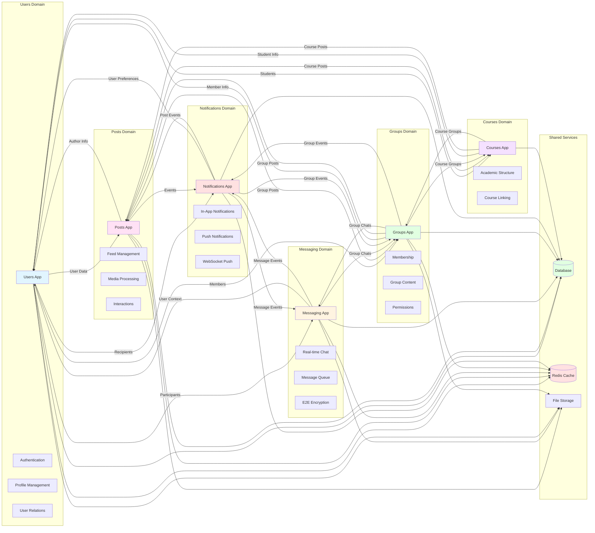
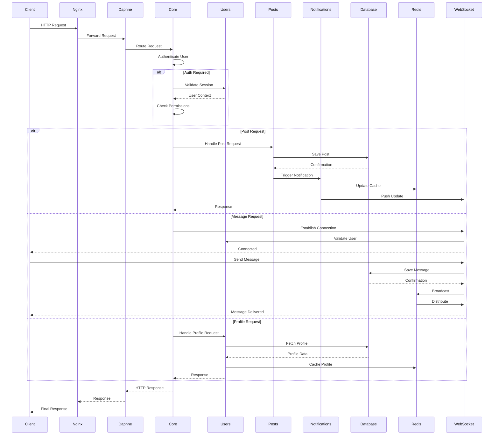
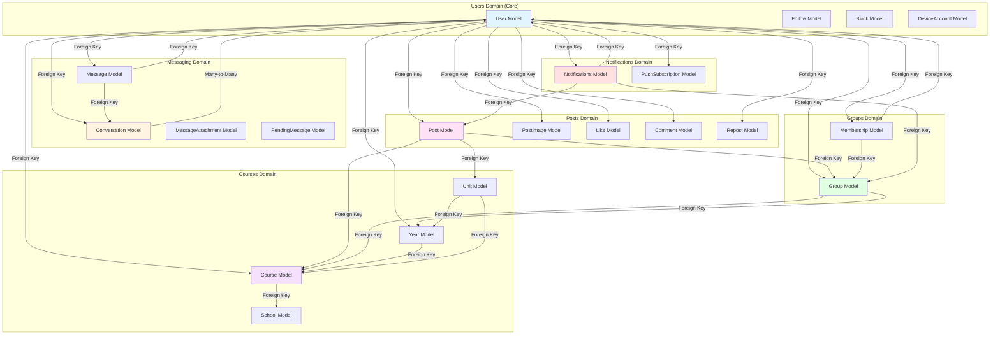
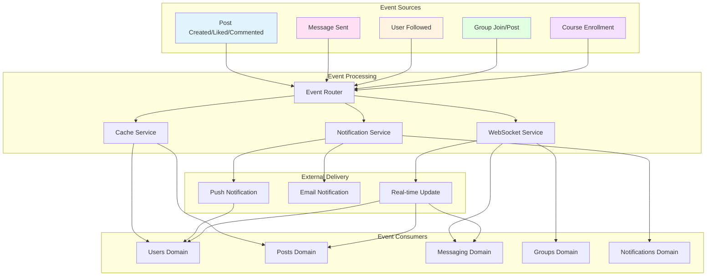
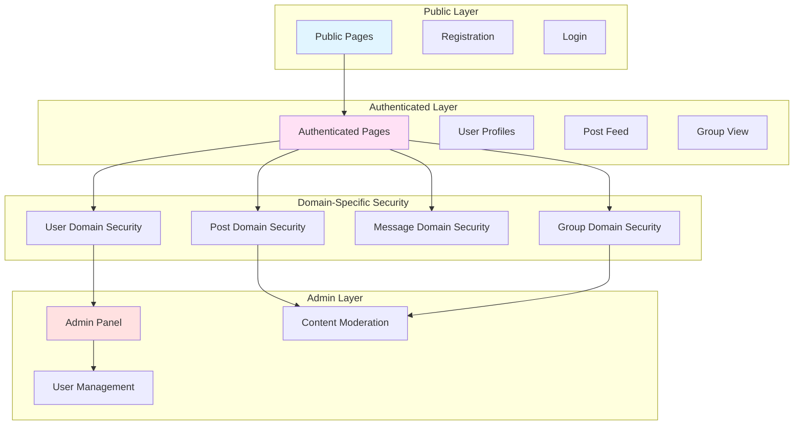

# PwaniNet Domain Communication Architecture

## 1. Overall System Architecture

```mermaid
graph TB
    subgraph "Client Layer"
        Browser[Web Browser]
        PWA[PWA Application]
        Mobile[Mobile Browser]
    end
    
    subgraph "Web Server Layer"
        Nginx[Nginx Reverse Proxy]
        Daphne[Daphne ASGI Server]
    end
    
    subgraph "Application Layer - Django"
        subgraph "Core Domain"
            Core[pwaninet core]
            Settings[Settings/Config]
            Middleware[Custom Middleware]
            Routing[URL Routing]
        end
        
        subgraph "Users Domain"
            UsersApp[users app]
            UserModels[User Models]
            UserViews[User Views]
            UserSerializers[User Serializers]
        end
        
        subgraph "Posts Domain"
            PostsApp[posts app]
            PostModels[Post Models]
            PostViews[Post Views]
            PostSerializers[Post Serializers]
        end
        
        subgraph "Messaging Domain"
            MessagingApp[messaging app]
            MessageModels[Message Models]
            MessageConsumers[WebSocket Consumers]
            MessageViews[Message Views]
        end
        
        subgraph "Groups Domain"
            GroupsApp[groups app]
            GroupModels[Group Models]
            GroupViews[Group Views]
        end
        
        subgraph "Notifications Domain"
            NotificationsApp[notifications app]
            NotificationModels[Notification Models]
            NotificationViews[Notification Views]
            PushService[Web Push Service]
        end
        
        subgraph "Courses Domain"
            CoursesApp[courses app]
            CourseModels[Course Models]
            CourseViews[Course Views]
        end
        
        subgraph "Realtime Domain"
            RealtimeApp[realtime app]
            RealtimeConsumers[Real-time Consumers]
        end
    end
    
    subgraph "Data Layer"
        PostgreSQL[(PostgreSQL Database)]
        Redis[(Redis Cache & Pub/Sub)]
        FileSystem[File Storage]
    end
    
    subgraph "Background Jobs"
        Celery[Celery Workers]
        CeleryBeat[Celery Beat Scheduler]
    end
    
    subgraph "External Services"
        VAPID[VAPID Push Service]
        LinkFetcher[Link Metadata Fetcher]
    end
    
    Browser -->|HTTP/HTTPS| Nginx
    PWA -->|HTTP/HTTPS| Nginx
    Mobile -->|HTTP/HTTPS| Nginx
    
    Nginx --> Daphne
    
    Daphne --> Core
    Core --> Settings
    Core --> Middleware
    Core --> Routing
    
    Routing --> UsersApp
    Routing --> PostsApp
    Routing --> MessagingApp
    Routing --> GroupsApp
    Routing --> NotificationsApp
    Routing --> CoursesApp
    Routing --> RealtimeApp
    
    UsersApp --> UserModels
    UsersApp --> UserViews
    UsersApp --> UserSerializers
    
    PostsApp --> PostModels
    PostsApp --> PostViews
    PostsApp --> PostSerializers
    
    MessagingApp --> MessageModels
    MessagingApp --> MessageConsumers
    MessagingApp --> MessageViews
    
    GroupsApp --> GroupModels
    GroupsApp --> GroupViews
    
    NotificationsApp --> NotificationModels
    NotificationsApp --> NotificationViews
    NotificationsApp --> PushService
    
    CoursesApp --> CourseModels
    CoursesApp --> CourseViews
    
    RealtimeApp --> RealtimeConsumers
    
    UserModels --> PostgreSQL
    PostModels --> PostgreSQL
    MessageModels --> PostgreSQL
    GroupModels --> PostgreSQL
    NotificationModels --> PostgreSQL
    CourseModels --> PostgreSQL
    
    UserViews --> Redis
    PostViews --> Redis
    MessageConsumers --> Redis
    NotificationViews --> Redis
    RealtimeConsumers --> Redis
    
    PostViews --> FileSystem
    MessageViews --> FileSystem
    UserViews --> FileSystem
    
    Core --> Celery
    Celery --> Redis
    CeleryBeat --> Celery
    
    PushService --> VAPID
    PostViews --> LinkFetcher
    
    style Browser fill:#e1f5ff
    style PWA fill:#e1f5ff
    style Mobile fill:#e1f5ff
    style PostgreSQL fill:#e1ffe1
    style Redis fill:#ffe1e1
    style VAPID fill:#fff4e1
    style LinkFetcher fill:#fff4e1
```



## 2. Domain Interactions and Communication



## 3. Request Flow Through Domains



## 4. Domain Data Dependencies



## 5. Cross-Domain Event Flow



## 6. API Endpoint Distribution by Domain

```mermaid
graph LR
    subgraph "Users Domain API"
        UsersAPI[users/]
        Profile[/users/&lt;username&gt;/]
        Register[/register/]
        UpdateProfile[/update-profile/]
        Follow[/users/&lt;id&gt;/follow/]
    end
    
    subgraph "Posts Domain API"
        PostsAPI[posts/]
        Home[/]
        PostDetail[/post/&lt;id&gt;/]
        CreatePost[/create/]
        Search[/search/]
        Like[/posts/&lt;id&gt;/like/]
    end
    
    subgraph "Messaging Domain API"
        MessagingAPI[messaging/]
        Conversations[/conversations/]
        ConversationDetail[/&lt;id&gt;/]
        Messages[/messages/]
        WebSocket[ws/chat/&lt;id&gt;/]
    end
    
    subgraph "Groups Domain API"
        GroupsAPI[groups/]
        GroupList[/]
        GroupDetail[/&lt;id&gt;/]
        CreateGroup[/create/]
        Join[/&lt;id&gt;/join/]
    end
    
    subgraph "Notifications Domain API"
        NotificationsAPI[notifications/]
        NotificationList[/]
        MarkRead[/&lt;id&gt;/mark_read/]
        PushSubscribe[/api/push/subscribe/]
        PushUnsubscribe[/api/push/unsubscribe/]
    end
    
    subgraph "Courses Domain API"
        CoursesAPI[courses/]
        CourseList[/]
        UnitDetail[/unit/&lt;id&gt;/]
    end
    
    subgraph "Shared API"
        APIHealth[/api/health/]
        APISchema[/api/schema/]
        APIDocs[/api/docs/]
    end
    
    style UsersAPI fill:#e1f5ff
    style PostsAPI fill:#ffe1f5
    style MessagingAPI fill:#fff4e1
    style GroupsAPI fill:#e1ffe1
    style NotificationsAPI fill:#ffe1e1
    style CoursesAPI fill:#f5e1ff
    style SharedAPI fill:#e1ffe1
```

## 7. Domain Responsibilities Summary

| Domain | Primary Responsibilities | Key Models | External Dependencies |
|--------|------------------------|------------|----------------------|
| **Users** | Authentication, profiles, user relationships | User, Follow, Block, DeviceAccount, UserSession | PostgreSQL, Redis, File Storage |
| **Posts** | Social feed, content creation, media handling | Post, PostImage, Like, Comment, Repost, SharedPost | PostgreSQL, Redis, File Storage, Link Fetcher |
| **Messaging** | Real-time chat, E2E encryption, attachments | Conversation, Message, MessageAttachment, PendingMessage, LinkPreview | PostgreSQL, Redis, WebSocket, File Storage |
| **Groups** | Community management, memberships, permissions | Group, Membership | PostgreSQL, Users Domain |
| **Notifications** | In-app alerts, push notifications, event handling | Notifications, PushSubscription | PostgreSQL, Redis, VAPID Service |
| **Courses** | Academic structure, course management | School, Course, Year, Unit | PostgreSQL, Users Domain |
| **Realtime** | WebSocket infrastructure, real-time features | N/A (consumers only) | Redis, Django Channels |

## 8. Communication Patterns

### Synchronous Communication (HTTP/HTTPS)
- **Client → Django**: Traditional HTTP requests for page loads, form submissions
- **Django → Database**: CRUD operations via Django ORM
- **Django → External APIs**: Link metadata fetching, push notifications

### Asynchronous Communication (WebSocket)
- **Client → Django**: Real-time messaging, live updates
- **Django → Redis**: Channel layer for message broadcasting
- **Redis → Django**: Pub/sub for real-time event distribution

### Background Processing (Celery)
- **Django → Celery**: Task queuing for heavy operations
- **Celery → Database**: Async data processing
- **Celery → Redis**: Task queue backend, result storage

### Cache Communication
- **Django → Redis**: Caching user sessions, notification counts, online status
- **Redis → Django**: Fast data retrieval for frequently accessed data
- **WebSocket → Redis**: Real-time state synchronization

## 9. Security Boundaries by Domain



## 10. Technology Stack by Domain

| Domain | Backend Tech | Frontend Tech | Database | Cache | Real-time |
|--------|--------------|---------------|----------|-------|-----------|
| **Users** | Django, DRF | Bootstrap, HTMX | PostgreSQL | Redis | - |
| **Posts** | Django, DRF | Bootstrap, HTMX, JS | PostgreSQL | Redis | WebSocket |
| **Messaging** | Django, Channels | Bootstrap, WebSocket | PostgreSQL | Redis | WebSocket |
| **Groups** | Django, DRF | Bootstrap, HTMX | PostgreSQL | Redis | - |
| **Notifications** | Django, DRF | Bootstrap, Web Push API | PostgreSQL | Redis | WebSocket |
| **Courses** | Django, DRF | Bootstrap, HTMX | PostgreSQL | Redis | - |
| **Realtime** | Django, Channels | - | - | Redis | WebSocket |
