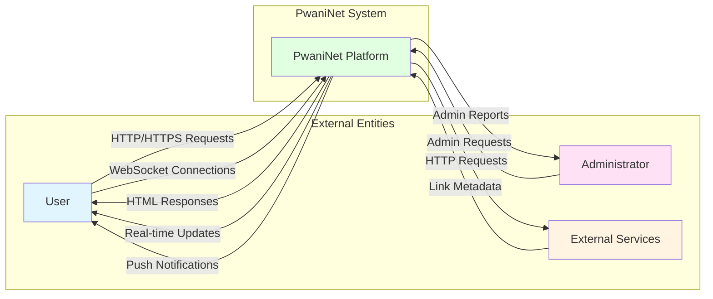
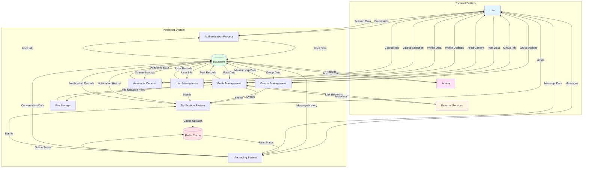
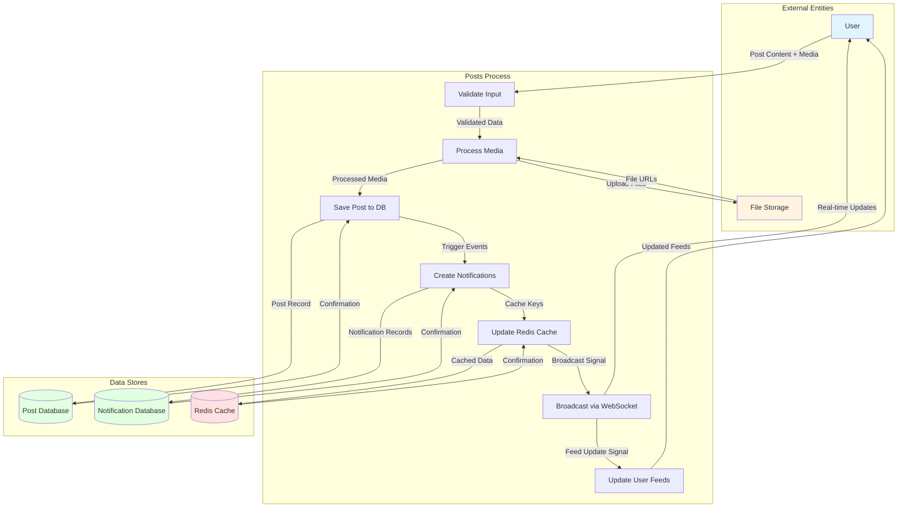
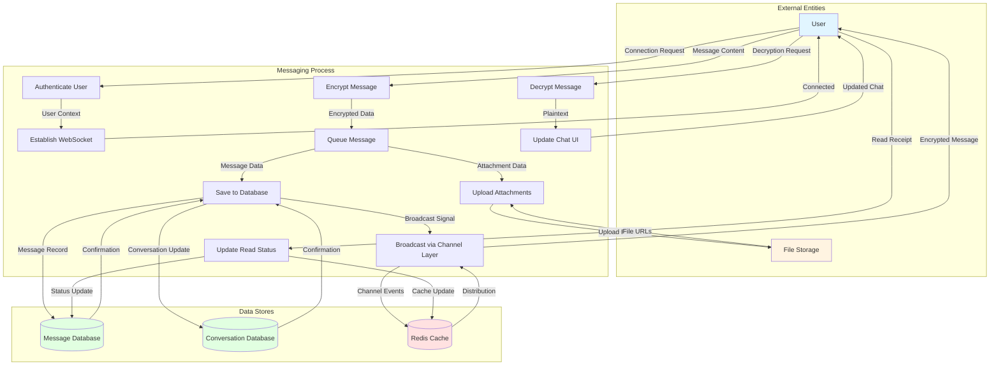
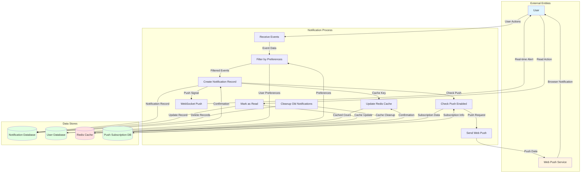
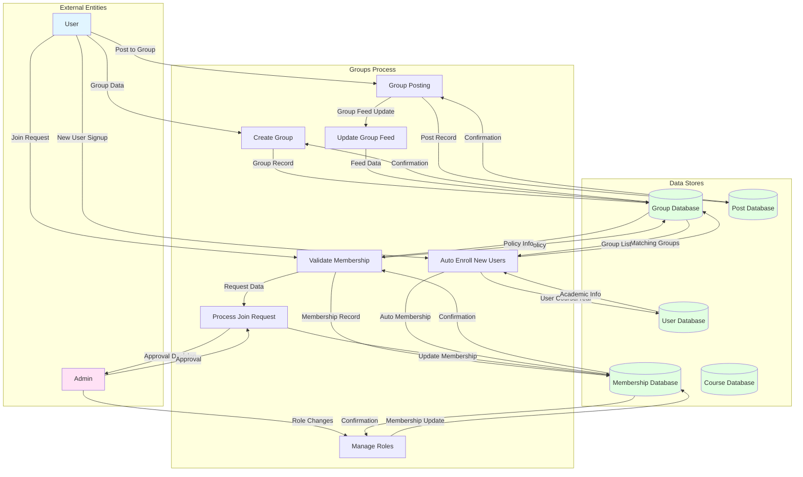
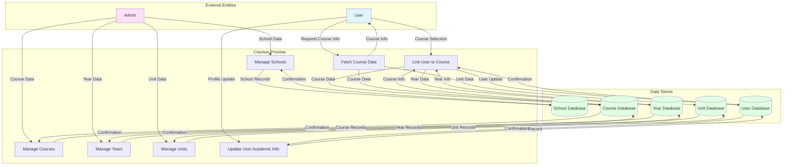

# PwaniNet Data Flow Diagrams (DFD)

## 1. Context Diagram (Level 0 DFD)

## 2. Level 0 DFD - Main System Processes

## 3. Level 1 DFD - Posts Management Process

## 4. Level 1 DFD - Messaging System Process

## 5. Level 1 DFD - User Management Process

```mermaid
graph TD
    subgraph "External Entities"
        User[User]
        Admin[Admin]
    end
    
    subgraph "User Management Process"
        ValidateCredentials[Validate Credentials]
        CreateSession[Create Session]
        UpdateProfile[Update Profile]
        ManageFollows[Manage Follows]
        HandleBlocks[Handle Blocks]
        UpdatePreferences[Update Preferences]
        TrackSessions[Track Sessions]
        DeviceManagement[Device Management]
    end
    
    subgraph "Data Stores"
        UserDB[(User Database)]
        SessionDB[(Session Database)]
        FollowDB[(Follow Database)]
        BlockDB[(Block Database)]
        RedisCache[(Redis Cache)]
    end
    
    User -->|Login Credentials| ValidateCredentials
    ValidateCredentials -->|Valid User| UserDB
    UserDB -->|User Data| ValidateCredentials
    
    ValidateCredentials -->|Session Data| CreateSession
    CreateSession -->|Session Record| SessionDB
    SessionDB -->|Confirmation| CreateSession
    CreateSession -->|Session Cookie| User
    
    User -->|Profile Updates| UpdateProfile
    UpdateProfile -->|User Record| UserDB
    UserDB -->|Confirmation| UpdateProfile
    
    User -->|Follow Actions| ManageFollows
    ManageFollows -->|Follow Records| FollowDB
    FollowDB -->|Confirmation| ManageFollows
    ManageFollows -->|Notification Trigger| User
    
    User -->|Block Actions| HandleBlocks
    HandleBlocks -->|Block Records| BlockDB
    BlockDB -->|Confirmation| HandleBlocks
    
    User -->|Preference Changes| UpdatePreferences
    UpdatePreferences -->|User Record| UserDB
    UpdatePreferences -->|Cache Update| RedisCache
    
    User -->|Session Activity| TrackSessions
    TrackSessions -->|Session Data| SessionDB
    TrackSessions -->|Online Status| RedisCache
    
    User -->|Device Switch| DeviceManagement
    DeviceManagement -->|Device Records| UserDB
    DeviceManagement -->|Session Update| SessionDB
    
    Admin -->|User Management| UserDB
    UserDB -->|User Reports| Admin
    
    style User fill:#e1f5ff
    style Admin fill:#ffe1f5
    style UserDB fill:#e1ffe1
    style SessionDB fill:#e1ffe1
    style FollowDB fill:#e1ffe1
    style BlockDB fill:#e1ffe1
    style RedisCache fill:#ffe1e1
```

## 6. Level 1 DFD - Notification System Process

## 7. Level 1 DFD - Groups Management Process

## 8. Level 1 DFD - Academic Courses Process

## 9. Data Dictionary

### Data Stores

| Data Store | Description | Key Entities |
|------------|-------------|--------------|
| **PostDB** | Stores all post-related data | Post, PostImage, Like, Comment, Repost, SharedPost |
| **MessageDB** | Stores messaging data | Conversation, Message, MessageAttachment, PendingMessage |
| **UserDB** | Stores user account data | User, Follow, Pinch, Block, DeviceAccount, UserSession |
| **GroupDB** | Stores group data | Group, Membership |
| **NotificationDB** | Stores notification data | Notifications, PushSubscription |
| **CourseDB** | Stores academic data | School, Course, Year, Unit |
| **SessionDB** | Stores session data | Django Sessions |
| **RedisCache** | In-memory cache for real-time data | Online status, notification counts, channel layers |
| **PushDB** | Stores push notification subscriptions | PushSubscription |

### Data Flows

| Data Flow | Source | Destination | Description |
|-----------|--------|-------------|-------------|
| **Post Content** | User | Posts Process | Text, media, course/unit selection |
| **Message Content** | User | Messaging Process | Encrypted messages, attachments |
| **Credentials** | User | Authentication | Username, password for login |
| **Session Data** | Authentication | User | Session cookie, user context |
| **Notification Events** | All Processes | Notification Process | Triggers for likes, follows, comments |
| **Real-time Updates** | WebSocket | User | Live messages, feed updates |
| **Push Notifications** | Push Service | User | Browser push notifications |
| **Media Files** | Storage | Posts/Messaging | Uploaded images, videos, documents |
| **Academic Data** | CourseDB | User | Course, year, unit information |
| **Group Data** | GroupDB | User | Group information, membership status |

### External Entities

| Entity | Description | Interactions |
|--------|-------------|--------------|
| **User** | End user of the platform | Posts, messages, profile management, group activities |
| **Admin** | Platform administrator | User management, content moderation, system configuration |
| **External Services** | Third-party APIs | Link metadata fetching, push notification services |
| **File Storage** | Media storage system | Upload and retrieval of images, videos, documents |
| **Web Push Service** | Browser push notification service | Delivery of push notifications to users |
