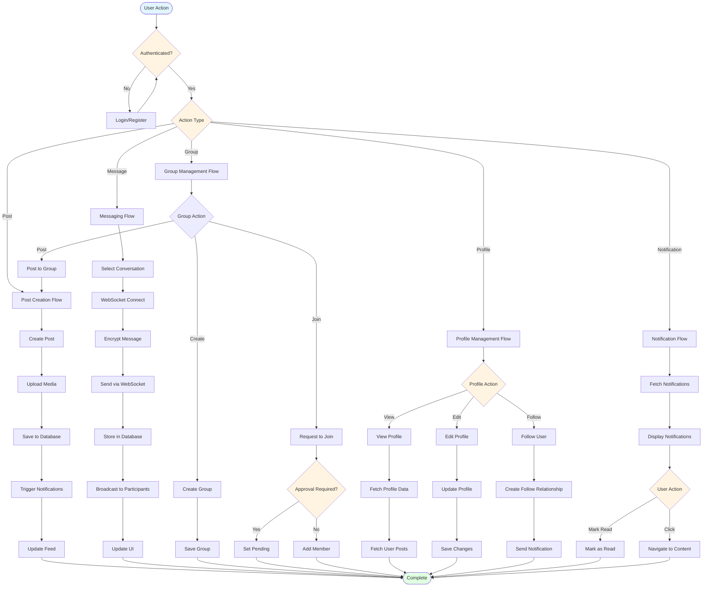
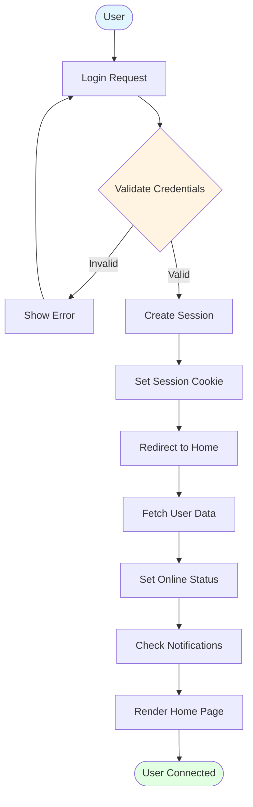
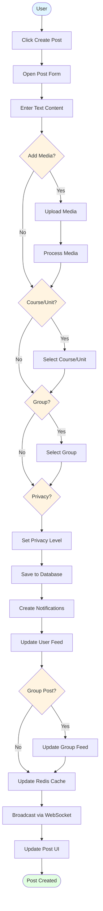
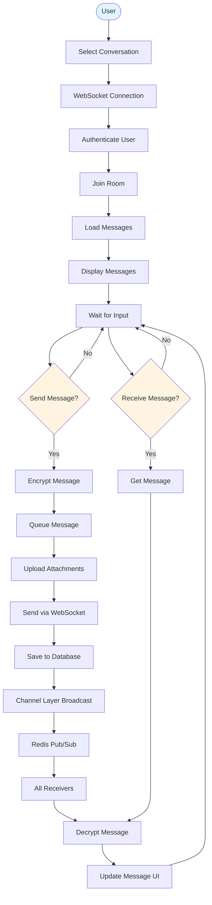
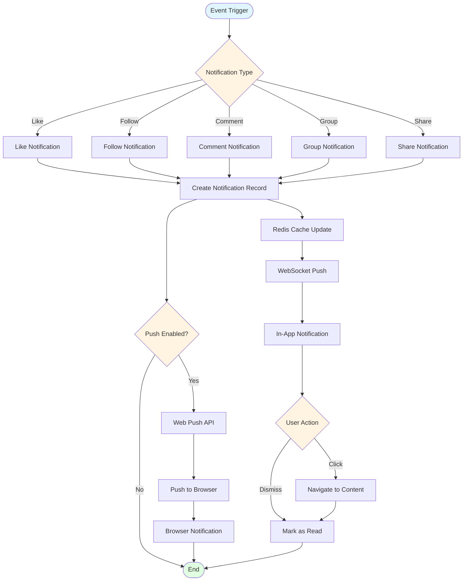
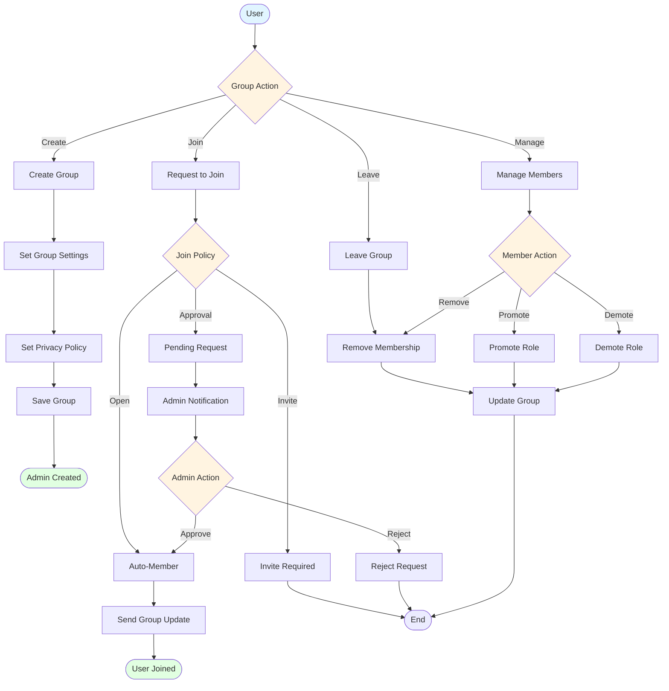
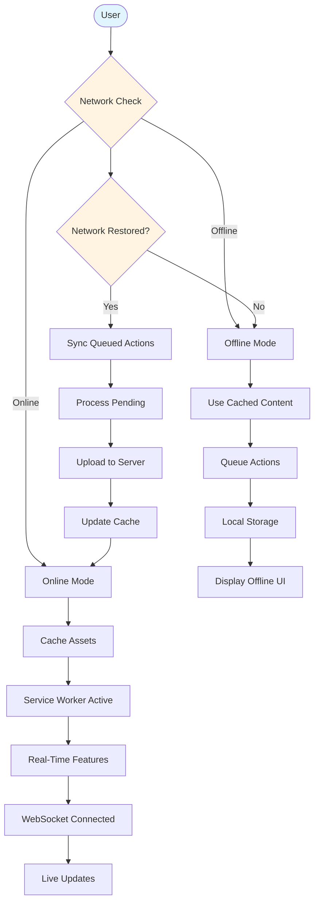

# PwaniNet Flow Chart Diagrams

## 1. System Flow Chart

## 2. User Authentication Flow

## 3. Post Creation Flow

## 4. Real-Time Messaging Flow

## 5. Notification Flow

## 6. Group Membership Flow

## 7. PWA Offline Flow

