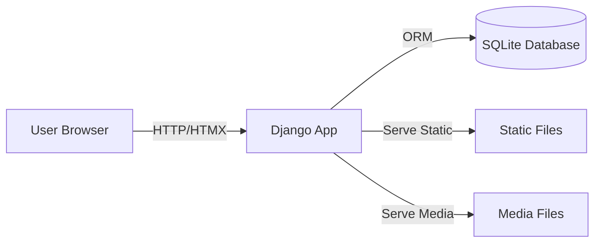
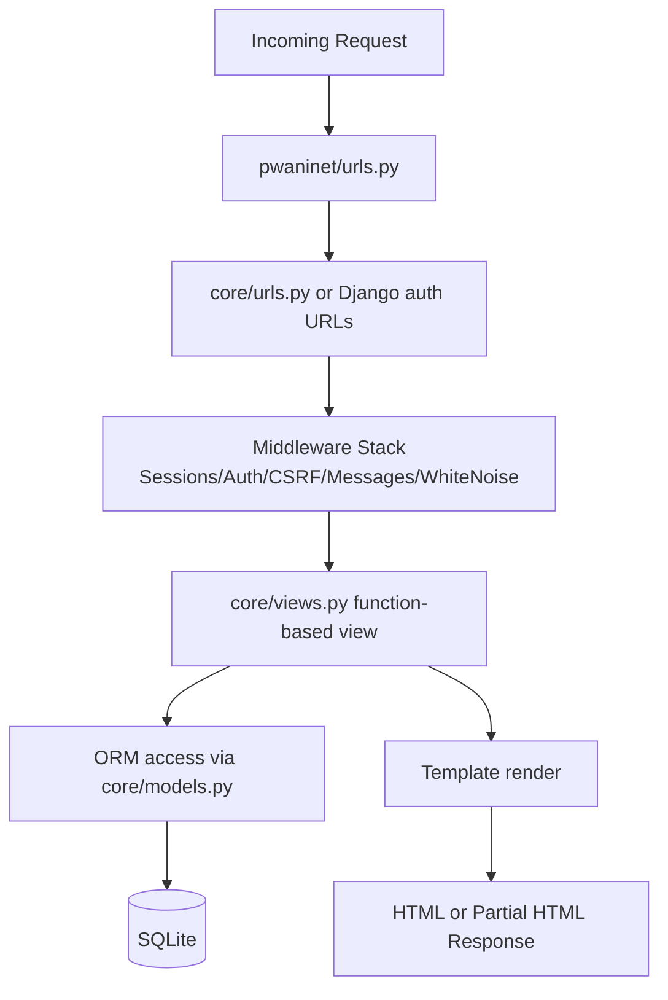
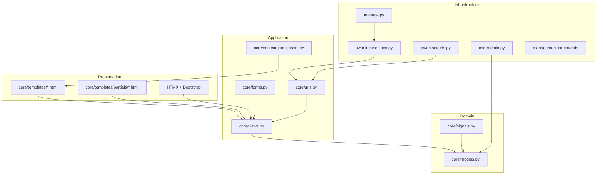
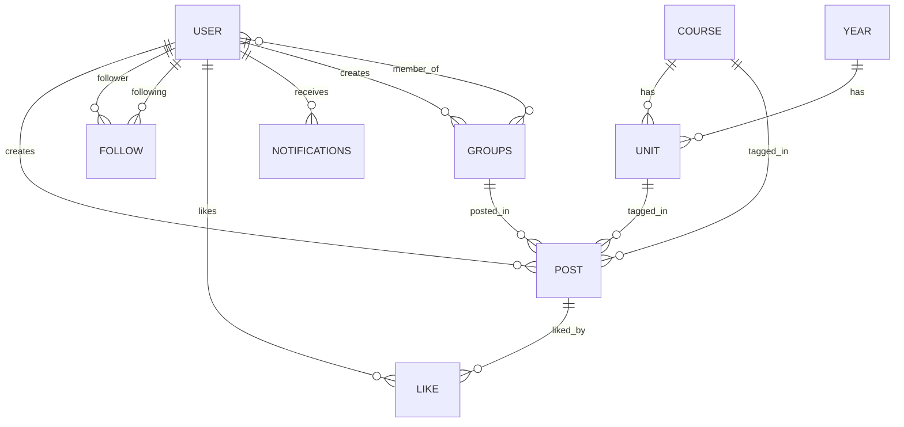

# PWANINET Architecture Map

This document gives a visual map of the system architecture and core data relationships.

## 1) System Context

## 2) Request Lifecycle

## 3) Layered Architecture

## 4) Core Domain Model Relationships

## 5) Feature-to-File Map

- Feed and posting: `core/views.py`, `core/templates/home.html`, `core/templates/partials/post_card.html`
- Search: `core/views.py`, `core/templates/search_results.html`, `core/templates/partials/search_results_content.html`
- Groups and membership: `core/views.py`, `core/templates/groups_*.html`, `core/models.py`
- Notifications: `core/views.py`, `core/context_processors.py`, `core/templates/partials/notification_badge.html`
- Authentication: `pwaninet/urls.py`, `core/forms.py`, `core/views.py`
- Data seeding: `core/management/commands/populate_units.py`, `core/management/commands/populate_posts.py`

## 6) Runtime Entrypoints

- Local/dev CLI: `manage.py`
- WSGI deployment: `pwaninet/wsgi.py`
- ASGI deployment: `pwaninet/asgi.py`

## 7) Notes

- The app is a server-rendered Django monolith with interactive partial updates.
- No dedicated REST API or async task queue is currently evident from project structure.
