# PwaniNet System Architecture Documentation

**Version:** 0.99.07  
**Last Updated:** 2026-05-13  
**Status:** Production Ready

---

## Table of Contents

1. [Executive Summary](#1-executive-summary)
2. [High-Level System Architecture](#2-high-level-system-architecture)
3. [Tech Stack Documentation](#3-tech-stack-documentation)
4. [Frontend Architecture](#4-frontend-architecture)
5. [Backend Architecture](#5-backend-architecture)
6. [Database Documentation](#6-database-documentation)
7. [Authentication & Security](#7-authentication--security)
8. [Real-Time Messaging System](#8-real-time-messaging-system)
9. [Redis Architecture](#9-redis-architecture)
10. [Docker & Infrastructure](#10-docker--infrastructure)
11. [API Documentation](#11-api-documentation)
12. [Data Flow Documentation](#12-data-flow-documentation)
13. [File & Module Ownership Map](#13-file--module-ownership-map)
14. [Performance & Scalability Analysis](#14-performance--scalability-analysis)
15. [Technical Debt & Risk Analysis](#15-technical-debt--risk-analysis)
16. [Future Expansion Possibilities](#16-future-expansion-possibilities)
17. [Developer Onboarding Guide](#17-developer-onboarding-guide)
18. [Glossary](#18-glossary)

---

## 1. Executive Summary

### 1.1 What is PwaniNet?

PwaniNet is a comprehensive social networking and academic collaboration platform designed specifically for university students and academic communities. It combines social media features with educational tools to create an integrated digital campus environment.

### 1.2 Problem Statement

University students and academic communities face fragmentation across multiple platforms:
- Social interactions scattered across different apps
- Academic resources disconnected from social collaboration
- No unified platform for course discussions, group projects, and social networking
- Limited real-time communication tools tailored for academic settings
- Poor offline support for students with unreliable internet access

### 1.3 Target Users

- **Primary:** University students across all years and courses
- **Secondary:** Faculty members, course instructors, academic administrators
- **Tertiary:** Campus organizations, student clubs, study groups

### 1.4 Platform Goals

1. **Unified Academic Social Network:** Combine social features with academic collaboration
2. **Real-Time Communication:** Enable instant messaging, group chats, and notifications
3. **Course Integration:** Link posts, discussions, and resources to specific courses and units
4. **Community Building:** Support groups, clubs, and academic communities
5. **Offline-First Architecture:** Ensure functionality with poor or no internet connectivity
6. **Privacy & Security:** Implement end-to-end encryption and robust access controls

### 1.5 Major Systems

| System | Purpose | Technology |
|--------|---------|------------|
| **Social Feed** | Posts, likes, comments, shares | Django REST Framework, HTMX |
| **Messaging** | Real-time chat, group conversations | Django Channels, WebSocket |
| **Groups** | Community management, memberships | Django ORM, permissions |
| **Notifications** | Push notifications, in-app alerts | Web Push API, Redis pub/sub |
| **Courses** | Academic structure, unit organization | Django models |
| **User Management** | Profiles, authentication, device switching | Django Auth, custom models |
| **PWA Layer** | Offline support, app installation | Service Worker, Manifest |

### 1.6 Architectural Philosophy

PwaniNet follows these core architectural principles:

1. **Modular Monolith:** Django-based monolithic application with clear app boundaries
2. **Progressive Enhancement:** Server-side rendering with client-side enhancements
3. **Offline-First:** PWA architecture with service workers and caching strategies
4. **Real-Time First:** WebSocket-based communication for instant updates
5. **Security by Design:** End-to-end encryption, rate limiting, access controls
6. **Scalability Ready:** Redis-backed channel layer, connection pooling, horizontal scaling support

---

## 2. High-Level System Architecture

### 2.1 Overall Architecture Diagram

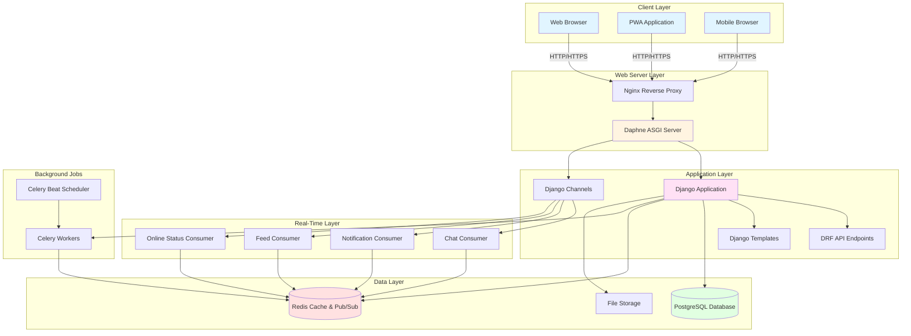

### 2.2 Frontend/Backend/Database Relationships

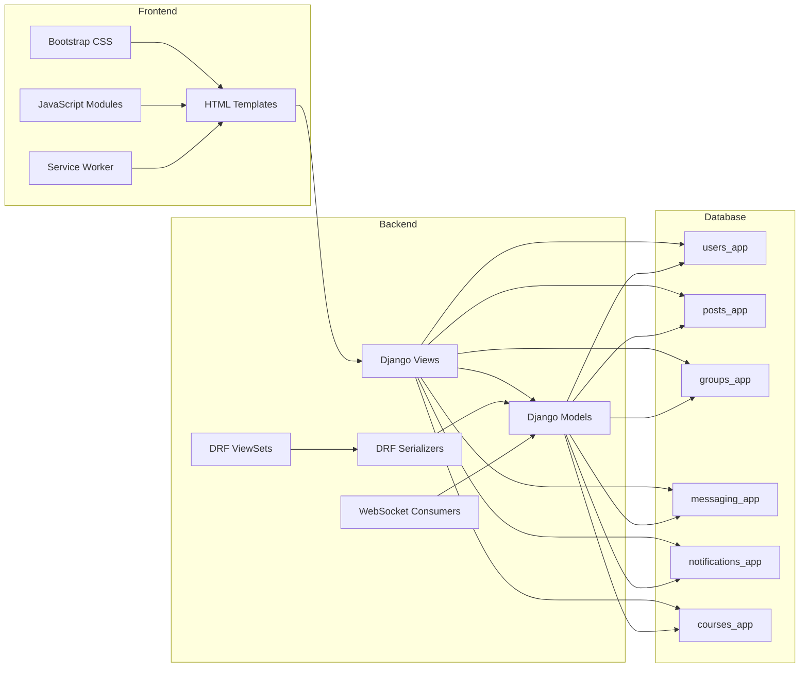

### 2.3 WebSocket Architecture

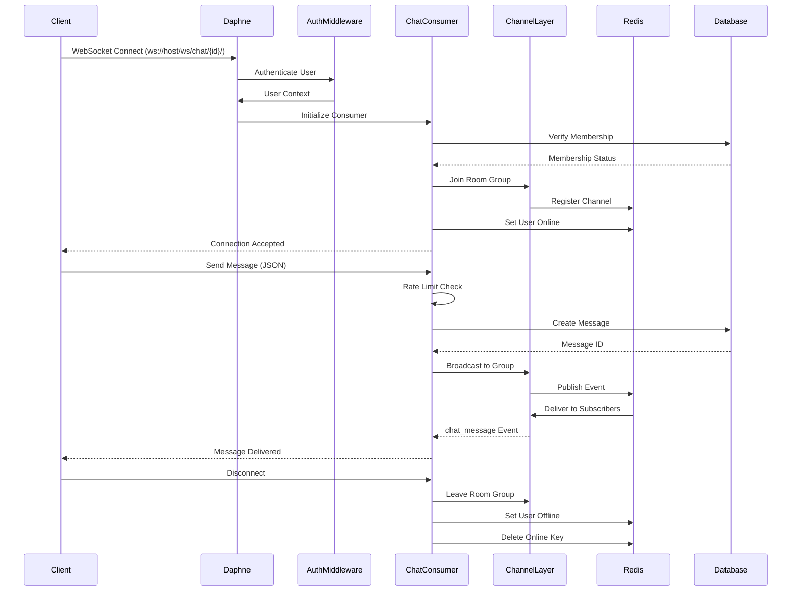

### 2.4 Redis Interaction

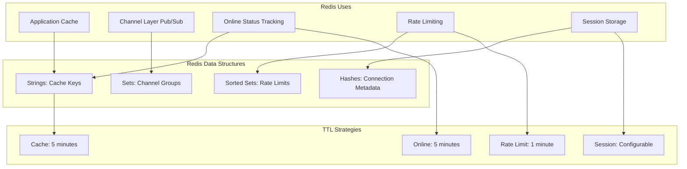

### 2.5 Docker/Container Interaction

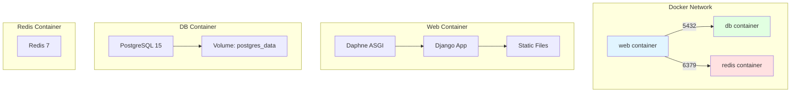

### 2.6 External Services

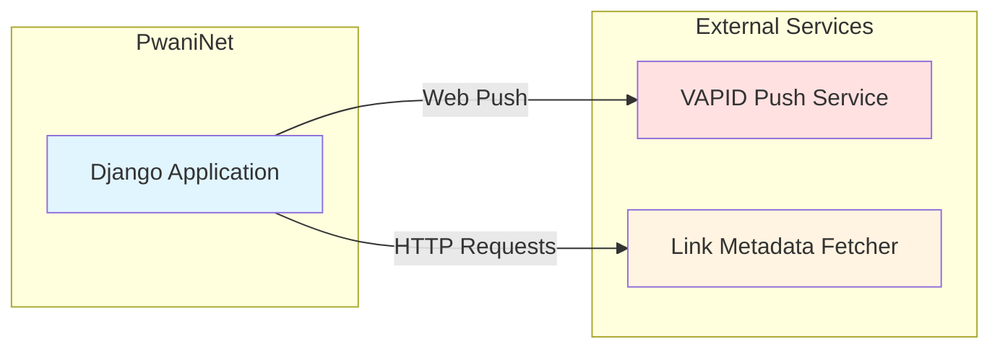

---

## 3. Tech Stack Documentation

### 3.1 Backend Technologies

| Technology | Version | Purpose | Advantages | Where Used |
|------------|---------|---------|------------|------------|
| **Python** | 3.11 | Core language | Modern syntax, async support, extensive ecosystem | Entire backend |
| **Django** | 5.2.13 | Web framework | Rapid development, ORM, admin panel, security features | All apps |
| **Django REST Framework** | 3.14.0 | API framework | Serialization, viewsets, authentication, throttling | API endpoints |
| **Django Channels** | 4.0.0 | WebSocket support | Async consumers, channel layers, real-time communication | Messaging, notifications |
| **Daphne** | 4.2.1 | ASGI server | WebSocket support, HTTP/2, async I/O | ASGI application |
| **PostgreSQL** | 15-alpine | Database | ACID compliance, JSON support, complex queries | Primary data store |
| **Redis** | 7-alpine | Cache/Message broker | In-memory, pub/sub, data structures | Caching, channel layer |
| **Celery** | 5.3.4 | Task queue | Distributed task processing, scheduling | Background jobs |
| **psycopg2** | 2.9.9 | PostgreSQL adapter | Efficient DB connectivity, async support | Database connections |

### 3.2 Frontend Technologies

| Technology | Version | Purpose | Advantages | Where Used |
|------------|---------|---------|------------|------------|
| **Bootstrap** | 5.x | UI framework | Responsive, components, utility classes | All templates |
| **HTMX** | Latest | Dynamic UI | Server-side rendering, progressive enhancement | Interactive components |
| **JavaScript (ES6+)** | Modern | Client logic | Async/await, modules, modern syntax | All JS modules |
| **Service Worker** | - | Offline support | Caching, background sync, push notifications | PWA functionality |
| **Web Push API** | - | Push notifications | Browser-native notifications | Push notifications |

### 3.3 WebSocket & Real-Time

| Technology | Version | Purpose | Advantages | Where Used |
|------------|---------|---------|------------|------------|
| **Django Channels** | 4.0.0 | WebSocket framework | Async consumers, channel layers | All WebSocket endpoints |
| **channels-redis** | 4.2.0 | Redis channel layer | Pub/sub, scaling support | Channel layer backend |
| **WebSockets** | - | Real-time protocol | Full-duplex, low latency | Chat, notifications |

### 3.4 Authentication & Security

| Technology | Version | Purpose | Advantages | Where Used |
|------------|---------|---------|------------|------------|
| **Django Auth** | Built-in | Authentication | Session-based, user model | Web authentication |
| **DRF Token Authentication** | Built-in | API auth | Stateless, simple | API endpoints |
| **django-axes** | 6.3.0 | Login protection | Rate limiting, lockout | Login attempts |
| **django-cors-headers** | 4.3.1 | CORS handling | Cross-origin requests | API access |
| **pywebpush** | 2.3.0 | Web push | VAPID, push notifications | Push notifications |

### 3.5 API Documentation

| Technology | Version | Purpose | Advantages | Where Used |
|------------|---------|---------|------------|------------|
| **drf-spectacular** | 0.27.0 | OpenAPI schema | Auto-generation, Swagger UI | API documentation |
| **OpenAPI 3.0** | - | API spec | Standard, tooling support | API contracts |

### 3.6 Deployment & Infrastructure

| Technology | Version | Purpose | Advantages | Where Used |
|------------|---------|---------|------------|------------|
| **Docker** | Latest | Containerization | Consistency, isolation | All services |
| **Docker Compose** | Latest | Orchestration | Multi-container management | Local development |
| **WhiteNoise** | 6.6.0 | Static files | Production serving, compression | Static file serving |
| **Gunicorn** | 21.2.0 | WSGI server | Production-ready, workers | Alternative WSGI |

### 3.7 Development Tools

| Technology | Version | Purpose | Advantages | Where Used |
|------------|---------|---------|------------|------------|
| **python-dotenv** | 1.2.2 | Environment vars | Configuration management | All environments |
| **django-filter** | 23.5 | Query filtering | Dynamic filtering | API filtering |
| **Faker** | 25.2.0 | Test data | Realistic test data | Database seeding |
| **Locust** | 2.37.11 | Load testing | Distributed load testing | Performance testing |

### 3.8 Utility Libraries

| Technology | Version | Purpose | Advantages | Where Used |
|------------|---------|---------|------------|------------|
| **Pillow** | 10.4.0 | Image processing | Resizing, optimization | Image uploads |
| **requests** | 2.33.1 | HTTP client | Simple API | Link fetching |
| **PyYAML** | 6.0.3 | YAML parsing | Configuration | Config files |

---

## 4. Frontend Architecture

### 4.1 Frontend Folder Structure

```
pwaninet/
├── static/
│   ├── css/
│   │   ├── bootstrap.min.css
│   │   ├── bootstrap-icons.css
│   │   ├── custom.css
│   │   ├── fonts.css
│   │   ├── splash.css
│   │   ├── chat_theme.css
│   │   └── messaging/
│   ├── js/
│   │   ├── bootstrap.bundle.min.js
│   │   ├── htmx.min.js
│   │   ├── auto_video_play.js
│   │   ├── device_manager.js
│   │   ├── encryption.js
│   │   ├── chat_theme_manager.js
│   │   ├── native-pwa-install.js
│   │   ├── offline-skeleton-v2.js
│   │   ├── offline-skeleton.js
│   │   ├── skeleton-init.js
│   │   ├── skeleton-loader.js
│   │   ├── splash-screen.js
│   │   ├── startup-final.js
│   │   ├── startup-fixed.js
│   │   ├── startup-safe.js
│   │   ├── startup-v2.js
│   │   ├── startup.js
│   │   ├── chat/
│   │   │   ├── bootstrap.js
│   │   │   ├── core/
│   │   │   ├── features/
│   │   │   ├── shared/
│   │   │   └── ui/
│   │   └── messaging/
│   │       ├── bootstrap.js
│   │       ├── network-status.js
│   │       ├── offline-cache.js
│   │       ├── offline-integration.js
│   │       ├── offline-ui.js
│   │       └── sync-manager.js
│   ├── fonts/
│   ├── images/
│   └── manifest.json
├── templates/
│   ├── base.html
│   ├── offline.html
│   ├── service-worker.js
│   ├── axes/
│   ├── registration/
│   ├── posts/
│   │   ├── home.html
│   │   ├── post_detail.html
│   │   ├── create_post.html
│   │   ├── search_results.html
│   │   ├── shared_posts.html
│   │   └── partials/
│   ├── users/
│   │   ├── profile.html
│   │   ├── register.html
│   │   ├── update_profile.html
│   │   ├── notification_preferences.html
│   │   └── partials/
│   ├── groups/
│   │   ├── group_list.html
│   │   ├── group_detail.html
│   │   ├── create_group.html
│   │   └── partials/
│   ├── messaging/
│   │   ├── conversation_list.html
│   │   ├── conversation_detail_refactored.html
│   │   └── partials/
│   ├── notifications/
│   │   └── partials/
│   └── courses/
│       └── partials/
```

### 4.2 Routing Architecture

PwaniNet uses Django's URL routing with namespaced patterns:

```mermaid
graph TD
    Root[pwaninet/urls.py]
    
    Root --> Posts[posts/urls.py - posts namespace]
    Root --> Users[users/urls.py - users namespace]
    Root --> Groups[groups/urls.py - groups namespace]
    Root --> Messaging[messaging/urls.py - messaging namespace]
    Root --> Notifications[notifications/urls.py - notifications namespace]
    Root --> Courses[courses/urls.py - courses namespace]
    
    Posts --> Home[/ - home view]
    Posts --> PostDetail[/post/<id>/ - post detail]
    Posts --> Search[/search/ - search]
    
    Users --> Profile[/user/<username>/ - profile]
    Users --> Register[/register/ - registration]
    Users --> UpdateProfile[/update-profile/ - update profile]
    
    Groups --> GroupList[/ - group list]
    Groups --> GroupDetail[/<id>/ - group detail]
    Groups --> CreateGroup[/create/ - create group]
    
    Messaging --> ConversationList[/ - conversation list]
    Messaging --> ConversationDetail[/<id>/ - conversation detail]
    
    Notifications --> NotificationList[/ - notification list]
    
    Courses --> CourseList[/ - course list]
    Courses --> UnitDetail[/unit/<id>/ - unit detail]
```

### 4.3 State Management

PwaniNet uses a hybrid state management approach:

| State Type | Storage | Update Mechanism | Scope |
|------------|---------|------------------|-------|
| **User Session** | Django Session | Server-side session middleware | Per user |
| **Online Status** | Redis | WebSocket heartbeat | Global |
| **Notification Count** | Redis Cache | Invalidation on new notification | Per user |
| **Form Data** | HTML Forms | POST/GET requests | Per request |
| **WebSocket State** | Channel Layer | Consumer methods | Per connection |
| **PWA Cache** | Service Worker Cache | Cache API | Per browser |
| **Device Account** | Database + Local Storage | Device ID tracking | Per device |

### 4.4 WebSocket Integration

Frontend WebSocket connection management:

```javascript
// WebSocket connection pattern
const protocol = window.location.protocol === 'https:' ? 'wss:' : 'ws:';
const wsUrl = `${protocol}//${window.location.host}/ws/chat/${conversationId}/`;
const socket = new WebSocket(wsUrl);

socket.onmessage = (event) => {
    const data = JSON.parse(event.data);
    switch(data.type) {
        case 'message':
            renderMessage(data.data);
            break;
        case 'typing':
            updateTypingIndicator(data);
            break;
        case 'user_status':
            updateOnlineStatus(data);
            break;
        case 'read_receipt':
            updateReadReceipt(data);
            break;
    }
};

socket.onclose = () => {
    // Reconnection logic
    setTimeout(() => connectWebSocket(), 5000);
};
```

### 4.5 Authentication Handling

Frontend authentication flow:

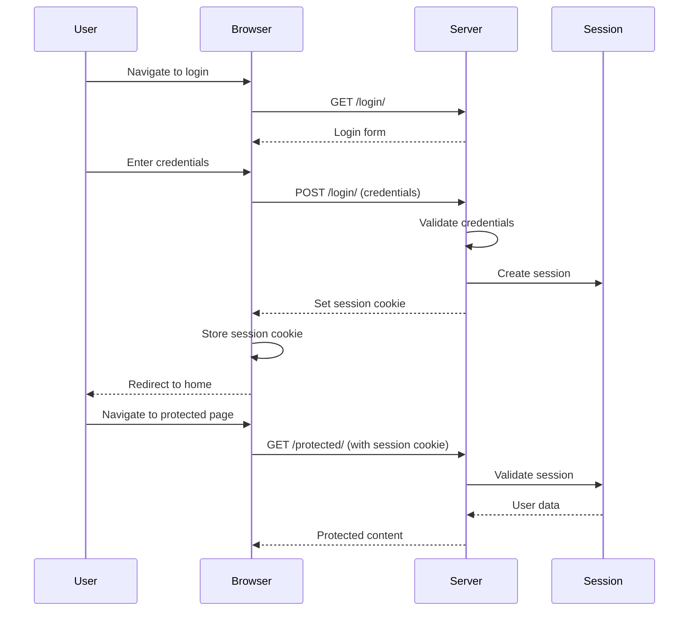

### 4.6 Protected Routes

Protected routes use Django's `@login_required` decorator:

```python
@login_required
def profile_view(request, username):
    # Only accessible to authenticated users
    profile_user = get_object_or_404(User, username=username)
    return render(request, 'users/profile.html', {'profile_user': profile_user})
```

### 4.7 Component Hierarchy

Template inheritance structure:

```
base.html (master template)
├── offline.html (PWA offline page)
├── posts/
│   ├── home.html (extends base)
│   ├── post_detail.html (extends base)
│   └── partials/
│       ├── post_item.html (reusable component)
│       ├── like_button.html (reusable component)
│       └── comments_section.html (reusable component)
├── users/
│   ├── profile.html (extends base)
│   └── partials/
│       ├── follow_button.html (reusable component)
│       └── suggestions.html (reusable component)
├── messaging/
│   ├── conversation_list.html (extends base)
│   └── partials/
│       ├── conversation_item.html (reusable component)
│       └── message_bubble.html (reusable component)
└── groups/
    ├── group_list.html (extends base)
    └── partials/
        ├── group_card.html (reusable component)
        └── member_list.html (reusable component)
```

### 4.8 Reusable Systems

**HTMX Partials:** Server-rendered HTML fragments for dynamic updates

**Template Tags:** Custom template tags for common operations

**Context Processors:** Global context data (notification counts, user info)

**JavaScript Modules:** Reusable JS functionality

### 4.9 UI Architecture

**Bootstrap 5** provides the UI framework with:

- Grid system for layout
- Components (cards, modals, navbars)
- Utility classes for spacing, colors
- Icons via Bootstrap Icons

**Custom CSS** extends Bootstrap with:
- Theme variables
- Custom animations
- Chat theme system
- Splash screen styles

### 4.10 API Communication Layer

Frontend API communication patterns:

```javascript
// Fetch API pattern
async function fetchAPI(endpoint, options = {}) {
    const response = await fetch(endpoint, {
        headers: {
            'Content-Type': 'application/json',
            'X-CSRFToken': getCSRFToken(),
            ...options.headers
        },
        credentials: 'same-origin',
        ...options
    });
    
    if (!response.ok) {
        throw new Error(`HTTP error! status: ${response.status}`);
    }
    
    return response.json();
}

// HTMX pattern for server-side updates
<button hx-post="/posts/123/like/"
        hx-target="#like-button-123"
        hx-swap="outerHTML">
    Like
</button>
```

### 4.11 Notification Handling

Notification system architecture:

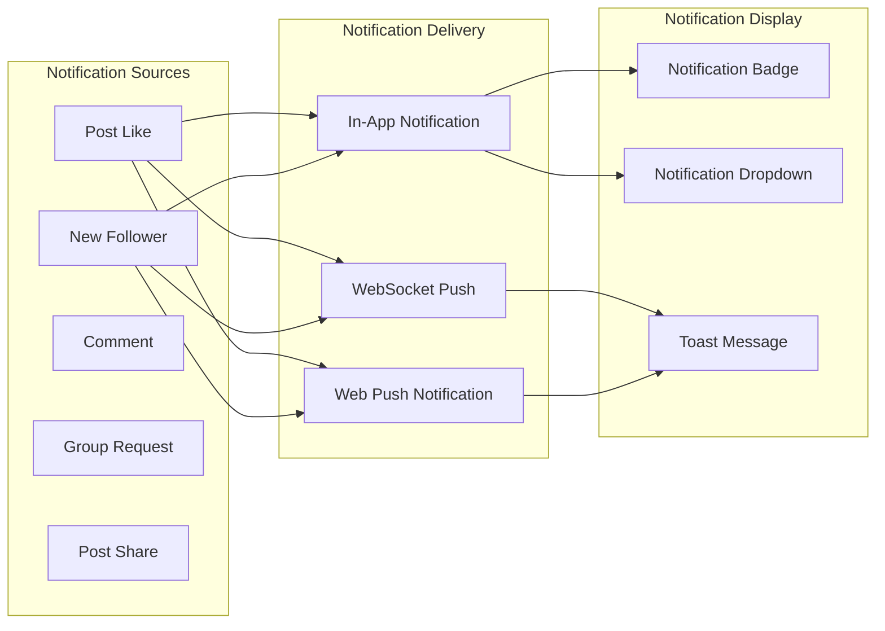

### 4.12 Caching Strategy

Frontend caching layers:

| Cache Type | Storage | TTL | Invalidation |
|------------|---------|-----|--------------|
| **Static Files** | Service Worker Cache | 1 year | Version updates |
| **API Responses** | Service Worker Cache | 5 minutes | Manual refresh |
| **HTML Pages** | Service Worker Cache | Network-first | Navigation |
| **Images** | Service Worker Cache | 30 days | Cache busting |
| **User Data** | Local Storage | Session | Logout |
| **Theme Preferences** | Local Storage | Persistent | User update |

### 4.13 Rendering Strategy

**Server-Side Rendering (SSR):** Primary rendering method
- Django templates render HTML on server
- SEO-friendly
- Fast initial page load
- Progressive enhancement with JavaScript

**Client-Side Updates:** Dynamic content updates
- HTMX for partial page updates
- WebSocket for real-time updates
- JavaScript for interactive features

### 4.14 Data Fetching Strategy

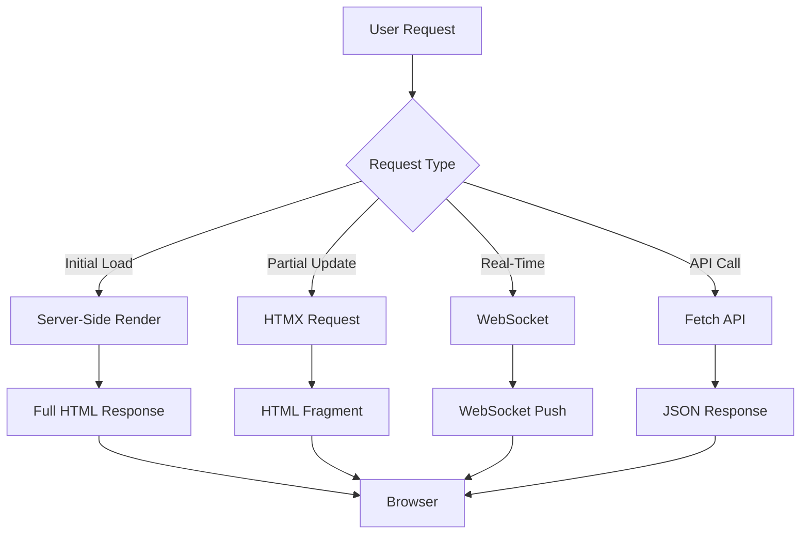

---

## 5. Backend Architecture

### 5.1 Backend Structure

```
pwaninet/
├── pwaninet/
│   ├── __init__.py
│   ├── asgi.py (ASGI configuration)
│   ├── wsgi.py (WSGI configuration)
│   ├── settings/
│   │   ├── __init__.py
│   │   ├── base.py (base settings)
│   │   ├── local.py (development)
│   │   └── production.py (production)
│   ├── urls.py (root URL configuration)
│   ├── routing.py (WebSocket routing)
│   ├── consumers.py (base WebSocket consumers)
│   ├── middleware.py (custom middleware)
│   ├── cache_backends.py (Redis cache with fallback)
│   ├── redis_client.py (Redis connection pool)
│   ├── celery.py (Celery configuration)
│   └── version.py
├── users/ (user management app)
├── posts/ (social feed app)
├── groups/ (community groups app)
├── messaging/ (real-time messaging app)
├── notifications/ (notifications app)
├── courses/ (academic courses app)
├── realtime/ (real-time features app)
├── core/ (core functionality app)
└── manage.py
```

### 5.2 Modular Design

Each Django app follows a consistent structure:

```
app_name/
├── __init__.py
├── models.py (data models)
├── views.py (Django views)
├── urls.py (URL routing)
├── serializers.py (DRF serializers)
├── permissions.py (custom permissions)
├── filters.py (query filters)
├── forms.py (Django forms)
├── admin.py (admin configuration)
├── apps.py (app configuration)
├── consumers.py (WebSocket consumers - if applicable)
├── routing.py (WebSocket routing - if applicable)
├── services/ (business logic)
│   ├── __init__.py
│   └── *_service.py
├── queries/ (complex queries)
│   ├── __init__.py
│   └── *_queries.py
├── templatetags/ (custom template tags)
│   ├── __init__.py
│   └── *.py
├── templates/ (app templates)
│   ├── app_name/
│   │   ├── *.html
│   │   └── partials/
│   │       └── *.html
├── management/ (management commands)
│   └── commands/
│       └── *.py
└── migrations/ (database migrations)
```

### 5.3 API Organization

REST API endpoints follow RESTful conventions:

```
/api/v1/
├── users/
│   ├── GET /users/ (list users)
│   ├── POST /users/ (create user)
│   ├── GET /users/{id}/ (get user)
│   ├── PUT /users/{id}/ (update user)
│   ├── PATCH /users/{id}/ (partial update)
│   ├── DELETE /users/{id}/ (delete user)
│   ├── POST /users/{id}/follow/ (follow user)
│   ├── GET /users/{id}/followers/ (get followers)
│   └── GET /users/{id}/following/ (get following)
├── posts/
│   ├── GET /posts/ (list posts)
│   ├── POST /posts/ (create post)
│   ├── GET /posts/{id}/ (get post)
│   ├── PUT /posts/{id}/ (update post)
│   ├── DELETE /posts/{id}/ (delete post)
│   ├── POST /posts/{id}/like/ (like post)
│   ├── GET /posts/{id}/comments/ (get comments)
│   └── POST /posts/{id}/repost/ (repost post)
├── conversations/
│   ├── GET /conversations/ (list conversations)
│   ├── POST /conversations/ (create conversation)
│   ├── GET /conversations/{id}/ (get conversation)
│   ├── POST /conversations/{id}/add_member/ (add member)
│   └── POST /conversations/{id}/mark_read/ (mark read)
├── messages/
│   ├── GET /messages/ (list messages)
│   ├── POST /messages/ (create message)
│   ├── GET /messages/{id}/ (get message)
│   ├── PUT /messages/{id}/ (update message)
│   ├── POST /messages/{id}/mark_read/ (mark read)
│   └── POST /messages/{id}/add_reaction/ (add reaction)
├── groups/
│   ├── GET /groups/ (list groups)
│   ├── POST /groups/ (create group)
│   ├── GET /groups/{id}/ (get group)
│   └── POST /groups/{id}/join/ (join group)
└── notifications/
    ├── GET /notifications/ (list notifications)
    └── POST /notifications/{id}/mark_read/ (mark read)
```

### 5.4 WebSocket Server Structure

WebSocket consumers organized by feature:

```mermaid
graph TD
    subgraph "WebSocket Consumers"
        ChatConsumer[messaging/consumers.py - ChatConsumer]
        NotificationConsumer[realtime/consumers.py - NotificationConsumer]
        FeedConsumer[realtime/consumers.py - FeedConsumer]
        OnlineStatusConsumer[realtime/consumers.py - OnlineStatusConsumer]
    end
    
    subgraph "WebSocket Routes"
        ChatRoute[ws/chat/{conversation_id}/]
        NotificationRoute[ws/notifications/]
        FeedRoute[ws/feed/]
        OnlineRoute[ws/online/]
    end
    
    ChatConsumer --> ChatRoute
    NotificationConsumer --> NotificationRoute
    FeedConsumer --> FeedRoute
    OnlineStatusConsumer --> OnlineRoute
```

### 5.5 Middleware Chain

```mermaid
graph LR
    Request[HTTP Request]
    
    Request --> CorsMiddleware[CorsMiddleware]
    CorsMiddleware --> SecurityMiddleware[SecurityMiddleware]
    SecurityMiddleware --> WhiteNoise[WhiteNoiseMiddleware]
    WhiteNoise --> SessionMiddleware[SessionMiddleware]
    SessionMiddleware --> CommonMiddleware[CommonMiddleware]
    CommonMiddleware --> CSRFMiddleware[CsrfViewMiddleware]
    CSRFMiddleware --> AuthMiddleware[AuthenticationMiddleware]
    AuthMiddleware --> MessageMiddleware[MessageMiddleware]
    MessageMiddleware --> XFrameMiddleware[XFrameOptionsMiddleware]
    XFrameMiddleware --> AxesMiddleware[AxesMiddleware]
    AxesMiddleware --> CSRFExempt[CSRFExemptMiddleware - local only]
    
    CSRFExempt --> View[Django View]
    
    View --> Response[HTTP Response]
    
    Response --> AxesMiddleware
    AxesMiddleware --> XFrameMiddleware
    XFrameMiddleware --> MessageMiddleware
    MessageMiddleware --> AuthMiddleware
    AuthMiddleware --> CSRFMiddleware
    CSRFMiddleware --> CommonMiddleware
    CommonMiddleware --> SessionMiddleware
    SessionMiddleware --> WhiteNoise
    WhiteNoise --> SecurityMiddleware
    SecurityMiddleware --> CorsMiddleware
    CorsMiddleware --> Request
```

### 5.6 Authentication Logic

Authentication backends:

```python
AUTHENTICATION_BACKENDS = [
    'axes.backends.AxesStandaloneBackend',  # Login attempt tracking
    'django.contrib.auth.backends.ModelBackend',  # Standard Django auth
]
```

Authentication flow:

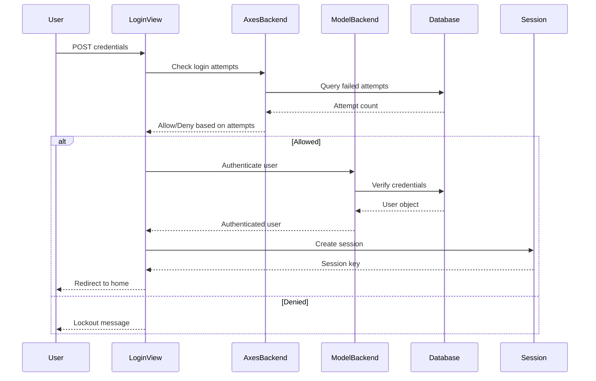

### 5.7 Permissions

Permission classes hierarchy:

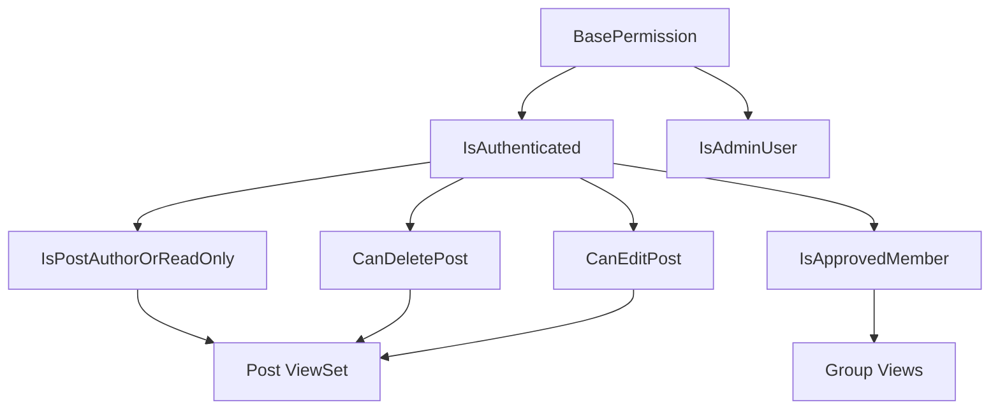

### 5.8 Serializers/Schemas

Serializer hierarchy:

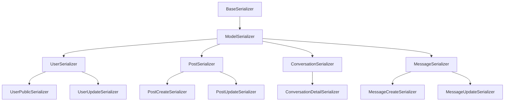

### 5.9 Services

Business logic separated into service modules:

```
services/
├── comment_service.py (comment operations)
├── feed_service.py (feed generation)
├── post_service.py (post operations)
├── repost_service.py (repost operations)
├── hide_service.py (post hiding)
├── author_preference_service.py (content filtering)
├── share_service.py (post sharing)
├── notification_service.py (notification management)
├── friend_suggestion_service.py (friend suggestions)
└── device_service.py (device account management)
```

### 5.10 Business Logic Separation

Architecture pattern:

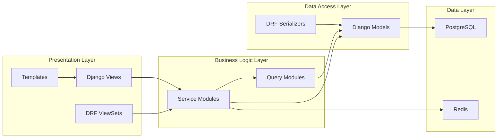

### 5.11 Async Systems

Async components:

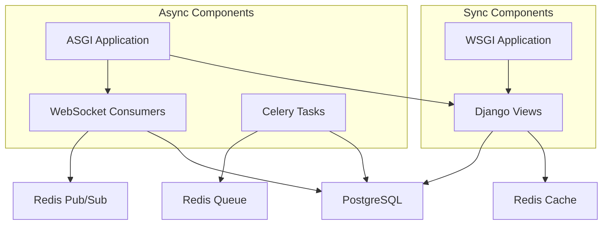

### 5.12 Background Jobs

Celery task types:

```python
# Example task structure
@app.task(bind=True)
def send_push_notification(self, user_id, notification_data):
    """Send push notification to user"""
    from notifications.models import PushSubscription
    from pywebpush import webpush
    
    subscriptions = PushSubscription.objects.filter(
        user_id=user_id,
        is_active=True
    )
    
    for sub in subscriptions:
        try:
            webpush(
                subscription_info={
                    'endpoint': sub.endpoint,
                    'keys': {
                        'p256dh': sub.p256dh,
                        'auth': sub.auth
                    }
                },
                data=notification_data,
                vapid_private_key=settings.VAPID_PRIVATE_KEY,
                vapid_claims={
                    'sub': 'mailto:admin@pwaninet.com'
                }
            )
        except Exception as e:
            logger.error(f"Push notification failed: {e}")
```

### 5.13 Caching

Cache backend architecture:

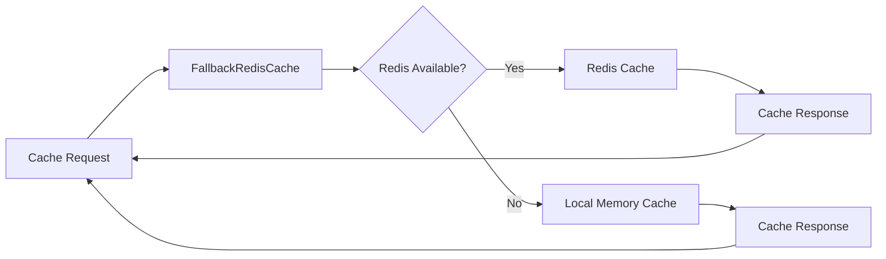

### 5.14 Event Handling

Event-driven architecture:

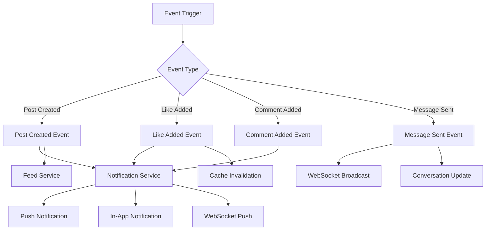

### 5.15 Scaling Strategy

Horizontal scaling considerations:

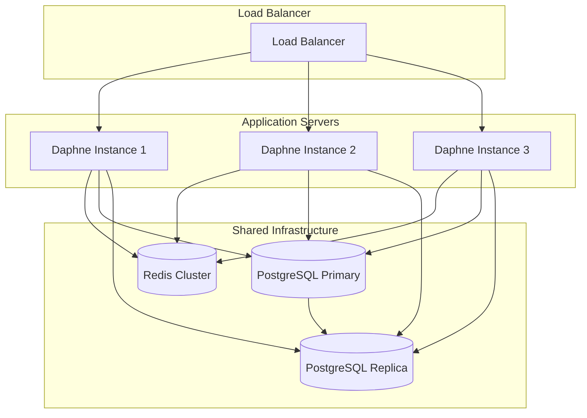

---

## 6. Database Documentation

### 6.1 Full Database Schema Analysis

#### Entity Relationship Diagram

```mermaid
erDiagram
    User ||--o{ Follow : "follower"
    User ||--o{ Follow : "followed"
    User ||--o{ Post : "author"
    User ||--o{ Comment : "author"
    User ||--o{ Like : "user"
    User ||--o{ CommentLike : "user"
    User ||--o{ Membership : "user"
    User ||--o{ ConversationMember : "user"
    User ||--o{ Message : "sender"
    User ||--o{ MessageRead : "user"
    User ||--o{ MessageReaction : "user"
    User ||--o{ ConversationTheme : "user"
    User ||--o{ Notifications : "recipient"
    User ||--o{ Notifications : "sender"
    User ||--o{ PushSubscription : "user"
    User ||--o{ DeviceAccount : "user"
    User ||--o{ Report : "reporter"
    User ||--o{ Repost : "reposter"
    User ||--o{ SharedPost : "sharer"
    User ||--o{ SharedPost : "shared_to"
    User ||--o{ HiddenPost : "user"
    User ||--o{ AuthorPreference : "user"
    User ||--o{ AuthorPreference : "author"
    User }|--|| Course : "course"
    User }|--|| Year : "year"
    
    Post ||--o{ PostImage : "post"
    Post ||--o{ Like : "post"
    Post ||--o{ Comment : "post"
    Post ||--o{ Report : "post"
    Post ||--o{ Repost : "original_post"
    Post ||--o{ Repost : "repost_children"
    Post ||--o{ HiddenPost : "post"
    Post ||--o{ SharedPost : "original_post"
    Post ||--o{ SharedPost : "shares"
    Post }|--o| Group : "group"
    Post }|--o| Course : "course"
    Post }|--o| Unit : "unit"
    
    Group ||--o{ Membership : "group"
    Group ||--o{ Post : "posts"
    Group ||--o{ Repost : "group"
    Group ||--o{ SharedPost : "shared_to_group"
    Group }|--o| Course : "course"
    Group }|--o| Year : "year"
    
    Course ||--o{ User : "users"
    Course ||--o{ Year : "years"
    Course ||--o{ Unit : "units"
    Course ||--o{ Group : "groups"
    Course ||--o{ Post : "posts"
    
    Year ||--o{ User : "users"
    Year ||--o{ Unit : "units"
    Year ||--o{ Group : "groups"
    
    Unit ||--o{ Post : "posts"
    
    Conversation ||--o{ ConversationMember : "members"
    Conversation ||--o{ Message : "messages"
    Conversation ||--o{ ConversationTheme : "themes"
    
    Message ||--o{ MessageRead : "read_receipts"
    Message ||--o{ MessageReaction : "reactions"
    Message ||--o{ Message : "replies"
    Message }|--o| Message : "reply_to"
    
    Notifications }|--o| User : "recipient"
    Notifications }|--o| User : "sender"
    Notifications }|--o| Post : "post"
    Notifications }|--o| Group : "group"
```

### 6.2 Table/Model Documentation

#### 6.2.1 User Model (users.User)

**Purpose:** Core user account with extended profile information

**Important Fields:**
- `id` (PK): Auto-incrementing primary key
- `username`: Unique username (inherited from AbstractUser)
- `email`: Email address (inherited from AbstractUser)
- `password`: Hashed password (inherited from AbstractUser)
- `first_name`: User's first name (indexed)
- `second_name`: User's middle name (indexed)
- `last_name`: User's last name (indexed)
- `year`: Foreign key to courses.Year
- `course`: Foreign key to courses.Course
- `global_role`: User's system role (PRESIDENT, DELEGATE, VERIFIED, NORMAL)
- `profile_pic`: Profile image
- `cover_photo`: Cover image
- `bio`: User biography (max 500 chars)
- `headline`: Professional tagline or headline (max 100 chars, optional)
- `interests`: Comma-separated interests (optional)
- `collaboration_status`: Current collaboration availability with choices:
  - `open_to_projects` - Open to collaborative projects
  - `open_to_study_groups` - Open to joining study groups
  - `open_to_networking` - Open to professional networking
  - `not_looking` - Not currently looking for collaborations
- `skills`: JSONField list of user skills (optional, scalable, taggable approach)
- `projects`: JSONField list of projects with structure:
  - `title` - Project name
  - `description` - Project description
  - `link` - Optional project URL
- `github_url`: GitHub profile URL (optional)
- `linkedin_url`: LinkedIn profile URL (optional)
- `portfolio_url`: Portfolio website URL (optional)
- `twitter_url`: Twitter/X profile URL (optional)
- `notify_on_like`: Boolean preference
- `notify_on_follow`: Boolean preference
- `notify_on_invite`: Boolean preference
- `notify_on_group_request`: Boolean preference
- `notify_on_group_approved`: Boolean preference
- `email_notifications`: Boolean preference
- `theme_preference`: Theme preference (light, dark, system)
- `is_online`: Online status flag
- `last_seen`: Last activity timestamp

**Relationships:**
- `year` → Year (many-to-one)
- `course` → Course (many-to-one)
- `following_relationships` → Follow (reverse FK, as follower)
- `follower_relationships` → Follow (reverse FK, as followed)
- `posts` → Post (reverse FK)
- `comments` → Comment (reverse FK)
- `likes` → Like (reverse FK)
- `group_memberships` → Membership (reverse FK)
- `conversation_memberships` → ConversationMember (reverse FK)
- `sent_messages` → Message (reverse FK)
- `message_reads` → MessageRead (reverse FK)
- `message_reactions` → MessageReaction (reverse FK)
- `conversation_themes` → ConversationTheme (reverse FK)
- `notifications` → Notifications (reverse FK, as recipient)
- `sent_notifications` → Notifications (reverse FK, as sender)
- `push_subscriptions` → PushSubscription (reverse FK)
- `device_accounts` → DeviceAccount (reverse FK)
- `reports` → Report (reverse FK)
- `reposts` → Repost (reverse FK)
- `shared_posts` → SharedSubscription (reverse FK, as sharer)
- `received_shares` → SharedPost (reverse FK, as shared_to)
- `hidden_posts` → HiddenPost (reverse FK)
- `author_preferences` → AuthorPreference (reverse FK, as user)
- `follower_preferences` → AuthorPreference (reverse FK, as author)

**Lifecycle:**
- Created on registration
- Updated on profile changes
- Deleted on account deletion (cascade to related records)
- Online status updated via WebSocket heartbeat

**Indexes:**
- `username` (unique)
- `email` (unique)
- `first_name` (indexed)
- `second_name` (indexed)
- `last_name` (indexed)
- `global_role` (indexed)

**Properties:**
- `is_profile_complete`: Boolean property indicating if user has completed academic identity (course and year)
- `profile_completion_percentage`: Calculated property returning profile completion score (0-100) based on:
  - Profile Picture: 15% (if not default)
  - Bio: 10% (if present)
  - Headline: 10% (if present)
  - Skills: 20% (if list not empty)
  - Projects: 20% (if list not empty)
  - Collaboration Status: 10% (if present)
  - External Links: 5% (if any link present)
  - Interests: 10% (if present)

#### 6.2.1.1 Profile Completion System

**Purpose:** Encourage users to build comprehensive profiles for better collaboration and networking opportunities

**Scoring Logic:**
```python
# Example calculation
user.profile_completion_percentage
# Returns: 65 (user has profile pic, bio, skills, and interests filled)
```

**UI Implementation:**
- **Owner View:** Shows progress bar with percentage and completion suggestions
- **Visitor View:** Hides completion data to maintain privacy
- **Suggestions Displayed when completion < 50%:**
  - "Add a headline to introduce yourself better"
  - "Add skills so classmates can discover your strengths"
  - "Add projects to showcase your work"
  - "Add interests to find like-minded classmates"

**Academic Identity Rules:**
- School automatically derived from `user.course.school.name`
- Course and year selected during signup, not editable afterward
- These fields form the user's immutable academic identity

#### 6.2.2 Follow Model (users.Follow)

**Purpose:** Track user-to-user follow relationships

**Important Fields:**
- `id` (PK): Auto-incrementing primary key
- `follower`: Foreign key to User (indexed)
- `followed`: Foreign key to User (indexed)
- `created_at`: Timestamp of follow creation (indexed)

**Relationships:**
- `follower` → User (many-to-one)
- `followed` → User (many-to-one)

**Constraints:**
- Unique together: (follower, followed)

**Indexes:**
- Composite index on (follower, followed)
- Composite index on (followed, follower)

**Lifecycle:**
- Created when user follows another user
- Deleted when user unfollows
- Used for feed generation and friend suggestions

#### 6.2.3 DeviceAccount Model (users.DeviceAccount)

**Purpose:** Track accounts used on specific devices for account switching

**Important Fields:**
- `id` (PK): Auto-incrementing primary key
- `user`: Foreign key to User (indexed)
- `device_id`: Hashed device identifier (indexed)
- `last_used`: Last usage timestamp (indexed)
- `session_key`: Django session key

**Relationships:**
- `user` → User (many-to-one)

**Constraints:**
- Unique together: (user, device_id)

**Indexes:**
- Composite index on (user, device_id)
- Composite index on (device_id, last_used)

**Lifecycle:**
- Created on first login from device
- Updated on each login
- Deleted when account removed from device

#### 6.2.4 Post Model (posts.Post)

**Purpose:** Social media posts with rich media support

**Important Fields:**
- `id` (PK): Auto-incrementing primary key
- `group`: Foreign key to Group (nullable)
- `author`: Foreign key to User
- `course`: Foreign key to Course (nullable)
- `unit`: Foreign key to Unit (nullable)
- `content`: Post text content
- `video`: Video file upload
- `docs`: Document file upload
- `audio`: Audio file upload
- `gradient_class`: Visual gradient style
- `repost_of`: Foreign key to self (nullable, for reposts)
- `created_at`: Creation timestamp (indexed)
- `updated_at`: Last update timestamp

**Relationships:**
- `group` → Group (many-to-one)
- `author` → User (many-to-one)
- `course` → Course (many-to-one)
- `unit` → Unit (many-to-one)
- `repost_of` → Post (self-referential, many-to-one)
- `images` → PostImage (reverse FK)
- `likes` → Like (reverse FK)
- `comments` → Comment (reverse FK)
- `reports` → Report (reverse FK)
- `repost_children` → Post (reverse FK, as repost_of)
- `hidden_by` → HiddenPost (reverse FK)
- `shares` → SharedPost (reverse FK)

**Lifecycle:**
- Created on post creation
- Updated on edits
- Deleted on post deletion (or soft delete)

**Indexes:**
- `created_at` (indexed)

#### 6.2.5 PostImage Model (posts.PostImage)

**Purpose:** Multiple images per post with ordering

**Important Fields:**
- `id` (PK): Auto-incrementing primary key
- `post`: Foreign key to Post
- `image`: Image file upload
- `order`: Display order
- `created_at`: Upload timestamp

**Relationships:**
- `post` → Post (many-to-one)

**Lifecycle:**
- Created with image upload
- Auto-resized to max 1080x1080
- Converted to JPEG format

#### 6.2.6 Like Model (posts.Like)

**Purpose:** Track post likes

**Important Fields:**
- `id` (PK): Auto-incrementing primary key
- `user`: Foreign key to User (indexed)
- `post`: Foreign key to Post (indexed)
- `created_at`: Like timestamp (indexed)

**Relationships:**
- `user` → User (many-to-one)
- `post` → Post (many-to-one)

**Constraints:**
- Unique together: (user, post)

**Indexes:**
- `user` (indexed)
- `post` (indexed)

#### 6.2.7 Comment Model (posts.Comment)

**Purpose:** Post comments

**Important Fields:**
- `id` (PK): Auto-incrementing primary key
- `post`: Foreign key to Post (indexed)
- `author`: Foreign key to User (indexed)
- `content`: Comment text
- `created_at`: Creation timestamp (indexed)

**Relationships:**
- `post` → Post (many-to-one)
- `author` → User (many-to-one)
- `likes` → CommentLike (reverse FK)

**Constraints:**
- Ordering: ['-created_at']

**Indexes:**
- `post` (indexed)
- `author` (indexed)
- `created_at` (indexed)

#### 6.2.8 CommentLike Model (posts.CommentLike)

**Purpose:** Track comment likes

**Important Fields:**
- `id` (PK): Auto-incrementing primary key
- `user`: Foreign key to User (indexed)
- `comment`: Foreign key to Comment (indexed)
- `created_at`: Like timestamp (indexed)

**Relationships:**
- `user` → User (many-to-one)
- `comment` → Comment (many-to-one)

**Constraints:**
- Unique together: (user, comment)

**Indexes:**
- `user` (indexed)
- `comment` (indexed)

#### 6.2.9 Report Model (posts.Report)

**Purpose:** Report inappropriate content

**Important Fields:**
- `id` (PK): Auto-incrementing primary key
- `reporter`: Foreign key to User
- `post`: Foreign key to Post
- `reason`: Report reason (max 50 chars)
- `description`: Detailed description
- `created_at`: Report timestamp

**Relationships:**
- `reporter` → User (many-to-one)
- `post` → Post (many-to-one)

**Constraints:**
- Unique together: (reporter, post)
- Ordering: ['-created_at']

#### 6.2.10 Repost Model (posts.Repost)

**Purpose:** Track reposts separately from post repost_of

**Important Fields:**
- `id` (PK): Auto-incrementing primary key
- `original_post`: Foreign key to Post
- `reposter`: Foreign key to User
- `group`: Foreign key to Group (nullable)
- `content`: Additional content for repost
- `created_at`: Repost timestamp (indexed)

**Relationships:**
- `original_post` → Post (many-to-one)
- `reposter` → User (many-to-one)
- `group` → Group (many-to-one)

**Constraints:**
- Unique together: (original_post, reposter, group)
- Ordering: ['-created_at']

#### 6.2.11 HiddenPost Model (posts.HiddenPost)

**Purpose:** Hide posts from user's feed

**Important Fields:**
- `id` (PK): Auto-incrementing primary key
- `user`: Foreign key to User
- `post`: Foreign key to Post
- `created_at`: Hide timestamp (indexed)

**Relationships:**
- `user` → User (many-to-one)
- `post` → Post (many-to-one)

**Constraints:**
- Unique together: (user, post)

#### 6.2.12 AuthorPreference Model (posts.AuthorPreference)

**Purpose:** Control content visibility from specific authors

**Important Fields:**
- `id` (PK): Auto-incrementing primary key
- `user`: Foreign key to User
- `author`: Foreign key to User
- `preference`: Preference level (normal, less, none)
- `created_at`: Creation timestamp
- `updated_at`: Last update timestamp

**Relationships:**
- `user` → User (many-to-one)
- `author` → User (many-to-one)

**Constraints:**
- Unique together: (user, author)

#### 6.2.13 SharedPost Model (posts.SharedPost)

**Purpose:** Share posts to users or groups

**Important Fields:**
- `id` (PK): Auto-incrementing primary key
- `original_post`: Foreign key to Post
- `sharer`: Foreign key to User
- `shared_to`: Foreign key to User (nullable)
- `shared_to_group`: Foreign key to Group (nullable)
- `message`: Share message
- `created_at`: Share timestamp (indexed)
- `is_viewed`: View status

**Relationships:**
- `original_post` → Post (many-to-one)
- `sharer` → User (many-to-one)
- `shared_to` → User (many-to-one)
- `shared_to_group` → Group (many-to-one)

**Constraints:**
- Unique constraint on (original_post, sharer, shared_to) when shared_to not null
- Unique constraint on (original_post, sharer, shared_to_group) when shared_to_group not null
- Check constraint: shared_to or shared_to_group must be set
- Ordering: ['-created_at']

#### 6.2.14 Group Model (groups.Group)

**Purpose:** Community groups with membership management

**Important Fields:**
- `id` (PK): Auto-incrementing primary key
- `name`: Group name (unique)
- `created_by`: Foreign key to User (nullable)
- `description`: Group description (max 500 chars)
- `group_pic`: Group profile image
- `cover_photo`: Group cover image
- `is_official`: Official group flag
- `join_policy`: Join policy (open, approval, invite)
- `course`: Foreign key to Course (nullable)
- `year`: Foreign key to Year (nullable)
- `created_at`: Creation timestamp

**Relationships:**
- `created_by` → User (many-to-one)
- `course` → Course (many-to-one)
- `year` → Year (many-to-one)
- `memberships` → Membership (reverse FK)
- `posts` → Post (reverse FK)
- `reposts` → Repost (reverse FK)
- `received_shares` → SharedPost (reverse FK)

**Constraints:**
- Unique: name
- Ordering: ['-created_at']

#### 6.2.15 Membership Model (groups.Membership)

**Purpose:** Track group memberships with roles

**Important Fields:**
- `id` (PK): Auto-incrementing primary key
- `user`: Foreign key to User (indexed)
- `group`: Foreign key to Group (indexed)
- `role`: Membership role (ADMIN, MODERATOR, DELEGATE, MEMBER) (indexed)
- `status`: Membership status (PENDING, APPROVED, REJECTED) (indexed)
- `joined_at`: Join timestamp (indexed)

**Relationships:**
- `user` → User (many-to-one)
- `group` → Group (many-to-one)

**Constraints:**
- Unique together: (user, group)
- Ordering: ['-joined_at']

**Indexes:**
- `user` (indexed)
- `group` (indexed)
- `role` (indexed)
- `status` (indexed)
- `joined_at` (indexed)

#### 6.2.16 Conversation Model (messaging.Conversation)

**Purpose:** Chat conversations (direct or group)

**Important Fields:**
- `id` (PK): Auto-incrementing primary key
- `type`: Conversation type (direct, group)
- `name`: Conversation name (for group chats)
- `is_encrypted`: E2E encryption flag
- `created_at`: Creation timestamp (indexed)
- `updated_at`: Last update timestamp (indexed)

**Relationships:**
- `members` → ConversationMember (reverse FK)
- `messages` → Message (reverse FK)
- `themes` → ConversationTheme (reverse FK)

**Constraints:**
- Ordering: ['-updated_at']

**Indexes:**
- `created_at` (indexed)
- `updated_at` (indexed)

**Methods:**
- `get_last_message_read_status(user)`: Get read status for user
- `get_direct_conversation_between(user1, user2)`: Find existing direct conversation

#### 6.2.17 ConversationMember Model (messaging.ConversationMember)

**Purpose:** Track conversation participants

**Important Fields:**
- `id` (PK): Auto-incrementing primary key
- `conversation`: Foreign key to Conversation
- `user`: Foreign key to User
- `joined_at`: Join timestamp
- `last_read_message`: Foreign key to Message (nullable)
- `is_muted`: Mute flag
- `public_key`: User's public key for E2E encryption

**Relationships:**
- `conversation` → Conversation (many-to-one)
- `user` → User (many-to-one)
- `last_read_message` → Message (many-to-one)
- `read_by_members` → MessageRead (reverse FK)

**Constraints:**
- Unique together: (conversation, user)

**Indexes:**
- Composite index on (conversation, user)
- Composite index on (user, conversation)

#### 6.2.18 Message Model (messaging.Message)

**Purpose:** Chat messages with rich content

**Important Fields:**
- `id` (PK): Auto-incrementing primary key
- `conversation`: Foreign key to Conversation (indexed)
- `sender`: Foreign key to User (indexed)
- `content`: Plain text content (nullable)
- `encrypted_content`: Encrypted content (nullable)
- `is_encrypted`: Encryption flag
- `attachment`: File attachment
- `attachment_type`: Attachment type (image, video, audio, document)
- `link_url`: Link URL
- `link_title`: Link title
- `link_description`: Link description
- `link_image`: Link image
- `link_type`: Link type (link, facebook, youtube, etc.)
- `reply_to`: Foreign key to self (nullable)
- `created_at`: Creation timestamp (indexed)
- `edited_at`: Edit timestamp (nullable)
- `is_deleted`: Deletion flag
- `status`: Message status (sent, delivered, read)

**Relationships:**
- `conversation` → Conversation (many-to-one)
- `sender` → User (many-to-one)
- `reply_to` → Message (self-referential, many-to-one)
- `reactions` → MessageReaction (reverse FK)
- `read_receipts` → MessageRead (reverse FK)
- `replies` → Message (reverse FK, as reply_to)

**Constraints:**
- Ordering: ['created_at']

**Indexes:**
- Composite index on (conversation, created_at)
- Composite index on (sender, created_at)

#### 6.2.19 MessageRead Model (messaging.MessageRead)

**Purpose:** Track message read receipts

**Important Fields:**
- `id` (PK): Auto-incrementing primary key
- `message`: Foreign key to Message
- `user`: Foreign key to User
- `read_at`: Read timestamp

**Relationships:**
- `message` → Message (many-to-one)
- `user` → User (many-to-one)

**Constraints:**
- Unique together: (message, user)

**Indexes:**
- Composite index on (message, user)
- Composite index on (user, read_at)

#### 6.2.20 MessageReaction Model (messaging.MessageReaction)

**Purpose:** Message reactions (emojis)

**Important Fields:**
- `id` (PK): Auto-incrementing primary key
- `message`: Foreign key to Message
- `user`: Foreign key to User
- `emoji`: Emoji character
- `created_at`: Reaction timestamp

**Relationships:**
- `message` → Message (many-to-one)
- `user` → User (many-to-one)

**Constraints:**
- Unique together: (message, user, emoji)

**Indexes:**
- Composite index on (message, emoji)
- Composite index on (user, created_at)

#### 6.2.21 ConversationTheme Model (messaging.ConversationTheme)

**Purpose:** Per-user per-conversation theme settings

**Important Fields:**
- `id` (PK): Auto-incrementing primary key
- `user`: Foreign key to User
- `conversation`: Foreign key to Conversation
- `theme_type`: Theme type (solid, gradient, image)
- `light_color`: Light mode hex color
- `dark_color`: Dark mode hex color
- `light_gradient_start`: Light gradient start color
- `light_gradient_end`: Light gradient end color
- `dark_gradient_start`: Dark gradient start color
- `dark_gradient_end`: Dark gradient end color
- `gradient_angle`: Gradient angle in degrees
- `light_image`: Light mode image
- `dark_image`: Dark mode image
- `light_image_hash`: Image deduplication hash
- `dark_image_hash`: Image deduplication hash
- `light_image_size`: Optimized image size
- `dark_image_size`: Optimized image size
- `image_fit`: Image fit mode (cover, contain, repeat)
- `overlay_opacity`: Overlay opacity (0.0-1.0)
- `light_overlay_color`: Light overlay color
- `dark_overlay_color`: Dark overlay color
- `created_at`: Creation timestamp
- `updated_at`: Last update timestamp

**Relationships:**
- `user` → User (many-to-one)
- `conversation` → Conversation (many-to-one)

**Constraints:**
- Unique together: (user, conversation)

**Indexes:**
- Composite index on (user, conversation)

**Methods:**
- `get_css_variables(theme_mode)`: Generate CSS variables
- `get_overlay_css(theme_mode)`: Generate overlay CSS

#### 6.2.22 PushSubscription Model (notifications.PushSubscription)

**Purpose:** Web push notification subscriptions

**Important Fields:**
- `id` (PK): Auto-incrementing primary key
- `user`: Foreign key to User (indexed)
- `endpoint`: Push endpoint (unique)
- `p256dh`: P256DH key
- `auth`: Auth key
- `user_agent`: User agent string
- `is_active`: Active status (indexed)
- `created_at`: Subscription timestamp
- `updated_at`: Last update timestamp

**Relationships:**
- `user` → User (many-to-one)

**Constraints:**
- Unique: endpoint

**Indexes:**
- `user` (indexed)
- `is_active` (indexed)

#### 6.2.23 Notifications Model (notifications.Notifications)

**Purpose:** In-app notifications

**Important Fields:**
- `id` (PK): Auto-incrementing primary key
- `recipient`: Foreign key to User (indexed)
- `sender`: Foreign key to User (indexed)
- `group`: Foreign key to Group (indexed, nullable)
- `post`: Foreign key to Post (indexed, nullable)
- `notification_type`: Notification type (indexed)
- `msg`: Notification message (max 255 chars)
- `timestamp`: Notification timestamp (indexed)
- `is_read`: Read status (indexed)

**Relationships:**
- `recipient` → User (many-to-one)
- `sender` → User (many-to-one)
- `group` → Group (many-to-one)
- `post` → Post (many-to-one)

**Constraints:**
- Ordering: ['-timestamp']

**Indexes:**
- `recipient` (indexed)
- `sender` (indexed)
- `group` (indexed)
- `post` (indexed)
- `notification_type` (indexed)
- `timestamp` (indexed)
- `is_read` (indexed)

**Notification Types:**
- INVITE: Group invite
- ALERTE: General alert
- LIKE: Post like
- FOLLOW: New follower
- GROUP_REQUEST: Group join request
- GROUP_APPROVED: Group join approved
- GROUP_REJECTED: Group join rejected
- POST_SHARED: Post shared to user
- POST_SHARED_TO_GROUP: Post shared to group

#### 6.2.24 Course Model (courses.Course)

**Purpose:** Academic courses

**Important Fields:**
- `id` (PK): Auto-incrementing primary key
- `name`: Course name (max 30 chars)

**Relationships:**
- `years` → Year (reverse FK)
- `units` → Unit (reverse FK)
- `users` → User (reverse FK)
- `groups` → Group (reverse FK)
- `posts` → Post (reverse FK)

#### 6.2.25 Year Model (courses.Year)

**Purpose:** Academic years within courses

**Important Fields:**
- `id` (PK): Auto-incrementing primary key
- `level`: Year level (positive integer)
- `course`: Foreign key to Course

**Relationships:**
- `course` → Course (many-to-one)
- `units` → Unit (reverse FK)
- `users` → User (reverse FK)
- `groups` → Group (reverse FK)

**Constraints:**
- Unique together: (level, course)
- Ordering: ['level']

#### 6.2.26 Unit Model (courses.Unit)

**Purpose:** Academic units within years

**Important Fields:**
- `id` (PK): Auto-incrementing primary key
- `code`: Unit code (unique, max 10 chars)
- `name`: Unit name (max 100 chars)
- `course`: Foreign key to Course
- `year`: Foreign key to Year (nullable)

**Relationships:**
- `course` → Course (many-to-one)
- `year` → Year (many-to-one)
- `posts` → Post (reverse FK)

### 6.3 Relationships Summary

| Relationship Type | From Model | To Model | Cardinality | Description |
|-------------------|------------|----------|-------------|-------------|
| **User-Follow** | User | Follow | One-to-Many | User can follow many users |
| **User-Post** | User | Post | One-to-Many | User can create many posts |
| **User-Comment** | User | Comment | One-to-Many | User can comment on many posts |
| **User-Like** | User | Like | One-to-Many | User can like many posts |
| **User-Membership** | User | Membership | One-to-Many | User can join many groups |
| **User-ConversationMember** | User | ConversationMember | One-to-Many | User can be in many conversations |
| **User-Message** | User | Message | One-to-Many | User can send many messages |
| **Post-PostImage** | Post | PostImage | One-to-Many | Post can have many images |
| **Post-Like** | Post | Like | One-to-Many | Post can have many likes |
| **Post-Comment** | Post | Comment | One-to-Many | Post can have many comments |
| **Group-Membership** | Group | Membership | One-to-Many | Group can have many members |
| **Conversation-Message** | Conversation | Message | One-to-Many | Conversation can have many messages |
| **Conversation-ConversationMember** | Conversation | ConversationMember | One-to-Many | Conversation can have many members |
| **Message-MessageReaction** | Message | MessageReaction | One-to-Many | Message can have many reactions |
| **Course-Year** | Course | Year | One-to-Many | Course can have many years |
| **Course-Unit** | Course | Unit | One-to-Many | Course can have many units |

### 6.4 Foreign Keys

| Model | Field | References | On Delete |
|-------|-------|------------|----------|
| User | year | courses.Year | SET_NULL |
| User | course | courses.Course | CASCADE |
| Post | group | groups.Group | CASCADE |
| Post | author | users.User | CASCADE |
| Post | course | courses.Course | CASCADE |
| Post | unit | courses.Unit | SET_NULL |
| Post | repost_of | posts.Post | CASCADE |
| PostImage | post | posts.Post | CASCADE |
| Like | user | users.User | CASCADE |
| Like | post | posts.Post | CASCADE |
| Comment | post | posts.Post | CASCADE |
| Comment | author | users.User | CASCADE |
| CommentLike | user | users.User | CASCADE |
| CommentLike | comment | posts.Comment | CASCADE |
| Report | reporter | users.User | CASCADE |
| Report | post | posts.Post | CASCADE |
| Repost | original_post | posts.Post | CASCADE |
| Repost | reposter | users.User | CASCADE |
| Repost | group | groups.Group | CASCADE |
| HiddenPost | user | users.User | CASCADE |
| HiddenPost | post | posts.Post | CASCADE |
| AuthorPreference | user | users.User | CASCADE |
| AuthorPreference | author | users.User | CASCADE |
| SharedPost | original_post | posts.Post | CASCADE |
| SharedPost | sharer | users.User | CASCADE |
| SharedPost | shared_to | users.User | CASCADE |
| SharedPost | shared_to_group | groups.Group | CASCADE |
| Group | created_by | users.User | SET_NULL |
| Group | course | courses.Course | SET_NULL |
| Group | year | courses.Year | SET_NULL |
| Membership | user | users.User | CASCADE |
| Membership | group | groups.Group | CASCADE |
| ConversationMember | conversation | messaging.Conversation | CASCADE |
| ConversationMember | user | users.User | CASCADE |
| ConversationMember | last_read_message | messaging.Message | SET_NULL |
| Message | conversation | messaging.Conversation | CASCADE |
| Message | sender | users.User | CASCADE |
| Message | reply_to | messaging.Message | SET_NULL |
| MessageRead | message | messaging.Message | CASCADE |
| MessageRead | user | users.User | CASCADE |
| MessageReaction | message | messaging.Message | CASCADE |
| MessageReaction | user | users.User | CASCADE |
| ConversationTheme | user | users.User | CASCADE |
| ConversationTheme | conversation | messaging.Conversation | CASCADE |
| PushSubscription | user | users.User | CASCADE |
| Notifications | recipient | users.User | CASCADE |
| Notifications | sender | users.User | CASCADE |
| Notifications | group | groups.Group | CASCADE |
| Notifications | post | posts.Post | CASCADE |
| Year | course | courses.Course | CASCADE |
| Unit | course | courses.Course | CASCADE |
| Unit | year | courses.Year | CASCADE |

### 6.5 Indexes

**User Model:**
- `username` (unique)
- `email` (unique)
- `first_name` (indexed)
- `second_name` (indexed)
- `last_name` (indexed)
- `global_role` (indexed)

**Follow Model:**
- Composite: (follower, followed)
- Composite: (followed, follower)

**Post Model:**
- `created_at` (indexed)

**Like Model:**
- `user` (indexed)
- `post` (indexed)

**Comment Model:**
- `post` (indexed)
- `author` (indexed)
- `created_at` (indexed)

**Membership Model:**
- `user` (indexed)
- `group` (indexed)
- `role` (indexed)
- `status` (indexed)
- `joined_at` (indexed)

**Conversation Model:**
- `created_at` (indexed)
- `updated_at` (indexed)

**Message Model:**
- Composite: (conversation, created_at)
- Composite: (sender, created_at)

**ConversationMember Model:**
- Composite: (conversation, user)
- Composite: (user, conversation)

**MessageRead Model:**
- Composite: (message, user)
- Composite: (user, read_at)

**MessageReaction Model:**
- Composite: (message, emoji)
- Composite: (user, created_at)

**ConversationTheme Model:**
- Composite: (user, conversation)

**PushSubscription Model:**
- `user` (indexed)
- `is_active` (indexed)
- `endpoint` (unique)

**Notifications Model:**
- `recipient` (indexed)
- `sender` (indexed)
- `group` (indexed)
- `post` (indexed)
- `notification_type` (indexed)
- `timestamp` (indexed)
- `is_read` (indexed)

**DeviceAccount Model:**
- Composite: (user, device_id)
- Composite: (device_id, last_used)

### 6.6 Constraints

**Unique Constraints:**
- User.username
- User.email
- Follow.(follower, followed)
- Like.(user, post)
- CommentLike.(user, comment)
- Report.(reporter, post)
- Repost.(original_post, reposter, group)
- HiddenPost.(user, post)
- AuthorPreference.(user, author)
- SharedPost.(original_post, sharer, shared_to) [conditional]
- SharedPost.(original_post, sharer, shared_to_group) [conditional]
- Group.name
- Membership.(user, group)
- ConversationMember.(conversation, user)
- MessageRead.(message, user)
- MessageReaction.(message, user, emoji)
- ConversationTheme.(user, conversation)
- PushSubscription.endpoint
- Unit.code
- Year.(level, course)

**Check Constraints:**
- SharedPost: shared_to OR shared_to_group must be set

**Validation Constraints:**
- User.global_role: Only one PRESIDENT allowed
- ConversationTheme: Theme-specific field validation

---

## 7. Authentication & Security

### 7.1 Login Flow

```mermaid
sequenceDiagram
    participant User
    participant Browser
    participant LoginView
    participant AxesBackend
    participant ModelBackend
    participant Database
    participant Session
    participant Redis
    
    User->>Browser: Navigate to /login/
    Browser->>LoginView: GET /login/
    LoginView-->>Browser: Login form HTML
    
    User->>Browser: Enter credentials
    Browser->>LoginView: POST /login/ {username, password}
    
    LoginView->>AxesBackend: Check login attempts
    AxesBackend->>Redis: Get failed attempt count
    Redis-->>AxesBackend: Attempt count
    
    alt Attempts < 5
        AxesBackend-->>LoginView: Allow login attempt
        LoginView->>ModelBackend: Authenticate
        ModelBackend->>Database: Query user by username
        Database-->>ModelBackend: User object
        ModelBackend->>ModelBackend: Verify password hash
        ModelBackend-->>LoginView: Authenticated user
        
        LoginView->>Session: Create session
        Session-->>LoginView: Session key
        LoginView->>Redis: Clear failed attempts
        LoginView-->>Browser: Redirect with session cookie
        Browser-->>User: Home page
    else Attempts >= 5
        AxesBackend-->>LoginView: Deny login attempt
        LoginView-->>Browser: Lockout message
        Browser-->>User: "Too many failed attempts"
    end
```

### 7.2 Token/Session Handling

**Session-Based Authentication:**
- Django session framework
- Session stored in database (default) or cache
- Session cookie sent with each request
- Session middleware validates session on each request

**Token-Based Authentication (API):**
- DRF Token Authentication
- Token stored in database
- Token sent in Authorization header: `Token <token_key>`
- Token authentication for API endpoints

**JWT Authentication (Temporarily Disabled):**
- SimpleJWT configured but disabled due to pkg_resources issue
- Would provide stateless authentication
- Access tokens (60 min lifetime)
- Refresh tokens (7 day lifetime)

### 7.3 JWT Configuration (Future)

```python
SIMPLE_JWT = {
    'ACCESS_TOKEN_LIFETIME': timedelta(minutes=60),
    'REFRESH_TOKEN_LIFETIME': timedelta(days=7),
    'ROTATE_REFRESH_TOKENS': True,
    'BLACKLIST_AFTER_ROTATION': True,
    'UPDATE_LAST_LOGIN': True,
    'ALGORITHM': 'HS256',
    'SIGNING_KEY': SECRET_KEY,
    'AUTH_HEADER_TYPES': ('Bearer',),
}
```

### 7.4 CSRF Protection

**CSRF Middleware:**
- CsrfViewMiddleware in middleware chain
- CSRF token generated for each session
- Token validated on POST requests
- Exempt for API endpoints in local development

**CSRF Trusted Origins:**
```python
CSRF_TRUSTED_ORIGINS = [
    f"http://{host.split(':')[0].strip()}"
    for host in os.environ.get('ALLOWED_HOSTS', 'localhost,127.0.0.1').split(',')
    if host.strip()
]
```

### 7.5 Permissions

**Permission Classes:**
- `IsAuthenticated`: User must be logged in
- `IsAdminUser`: User must be admin
- `IsPostAuthorOrReadOnly`: Author can edit, others read-only
- `CanDeletePost`: Author can delete within time limit
- `CanEditPost`: Author can edit within time limit
- `IsApprovedMember`: User must be approved group member

**Global Roles:**
- PRESIDENT: System administrator (only one allowed)
- DELEGATE: System delegate
- VERIFIED: Verified user
- NORMAL: Regular user

**Group Roles:**
- ADMIN: Full group control
- MODERATOR: Content moderation
- DELEGATE: Limited admin privileges
- MEMBER: Regular member

### 7.6 WebSocket Authentication

**Authentication Flow:**
```mermaid
sequenceDiagram
    participant Client
    participant AuthMiddleware
    participant ChatConsumer
    participant Database
    
    Client->>AuthMiddleware: WebSocket Connect
    AuthMiddleware->>AuthMiddleware: Extract session cookie
    AuthMiddleware->>Database: Validate session
    Database-->>AuthMiddleware: User object
    AuthMiddleware-->>ChatConsumer: Authenticated user
    
    ChatConsumer->>Database: Verify conversation membership
    Database-->>ChatConsumer: Membership status
    
    alt Member
        ChatConsumer-->>Client: Connection accepted
    else Not member
        ChatConsumer-->>Client: Connection rejected
    end
```

**AuthMiddlewareStack:**
- Wraps WebSocket consumers
- Extracts user from session
- Passes user to consumer scope
- Rejects anonymous connections

### 7.7 Access Control

**Model-Level Access Control:**
- Query filtering by user
- Permission checks in views
- Custom permission classes

**Example:**
```python
def get_queryset(self):
    """Return conversations for the current user."""
    return Conversation.objects.filter(
        members__user=self.request.user
    ).distinct()
```

**Row-Level Security:**
- User can only access their own data
- Group membership checks
- Conversation membership checks

### 7.8 Environment Variable Security

**Sensitive Variables:**
- `SECRET_KEY`: Django secret key
- `DB_PASSWORD`: Database password
- `VAPID_PRIVATE_KEY`: Web push private key
- `REDIS_PASSWORD`: Redis password (if configured)

**Environment Files:**
- `.env`: Local development (not committed)
- `.env.example`: Template (committed)
- `.env.docker`: Docker configuration

**Loading:**
```python
from dotenv import load_dotenv
load_dotenv(os.path.join(BASE_DIR, ".env"))
```

### 7.9 Rate Limiting

**django-axes Configuration:**
```python
AXES_FAILURE_LIMIT = 5
AXES_COOLOFF_TIME = timedelta(minutes=30)
AXES_LOCKOUT_TEMPLATE = 'axes/lockout.html'
AXES_RESET_ON_SUCCESS = True
```

**DRF Throttling:**
```python
DEFAULT_THROTTLE_RATES = {
    'anon': '100/hour',
    'user': '1000/hour',
    'message_send': '60/minute',
    'message_reaction': '30/minute',
    'conversation_create': '10/minute',
    'ws_message': '100/minute',
}
```

**WebSocket Rate Limiting:**
- Token bucket algorithm
- 100 messages/minute per connection
- Redis-backed counters
- Automatic cleanup

### 7.10 Encryption/Security Considerations

**Password Security:**
- PBKDF2 SHA256 hashing
- Password validation (length, common passwords)
- Secure password reset flow

**End-to-End Encryption:**
- Public/private key pairs per conversation
- Client-side encryption
- Server stores only encrypted content
- Keys stored in ConversationMember model

**Data in Transit:**
- HTTPS recommended in production
- TLS/SSL certificates
- Secure cookie flags in production

**Data at Rest:**
- Database encryption (PostgreSQL)
- File system encryption (recommended)
- Backup encryption

**Security Headers:**
```python
SECURE_BROWSER_XSS_FILTER = True
SECURE_CONTENT_TYPE_NOSNIFF = True
X_FRAME_OPTIONS = 'DENY'
SESSION_COOKIE_SECURE = True  # Production
CSRF_COOKIE_SECURE = True  # Production
```

### 7.11 Auth Flow Diagram

```mermaid
graph TD
    Start[User Request]
    
    Start --> AuthCheck{Authenticated?}
    
    AuthCheck -->|No| LoginRedirect[Redirect to Login]
    AuthCheck -->|Yes| PermissionCheck{Has Permission?}
    
    LoginRedirect --> LoginView[Login View]
    LoginView --> Credentials[Enter Credentials]
    Credentials --> AxesCheck[Axes Check]
    
    AxesCheck -->|Locked| Lockout[Lockout Page]
    AxesCheck -->|Allowed| AuthBackend[Authenticate]
    
    AuthBackend -->|Success| SessionCreate[Create Session]
    AuthBackend -->|Failure| AxesIncrement[Increment Counter]
    
    SessionCreate --> SuccessRedirect[Redirect to Original]
    AxesIncrement --> LoginView
    
    PermissionCheck -->|No| Forbidden[403 Forbidden]
    PermissionCheck -->|Yes| Resource[Access Resource]
    
    Lockout --> End
    Forbidden --> End
    SuccessRedirect --> End
    Resource --> End
```

---

## 8. Real-Time Messaging System

### 8.1 WebSocket Architecture

```mermaid
graph TB
    subgraph "Client Layer"
        ChatClient[Chat Client JS]
        NotificationClient[Notification Client JS]
    end
    
    subgraph "WebSocket Layer"
        Daphne[Daphne ASGI Server]
        AuthMiddleware[Auth Middleware Stack]
    end
    
    subgraph "Consumer Layer"
        ChatConsumer[ChatConsumer]
        NotificationConsumer[NotificationConsumer]
        FeedConsumer[FeedConsumer]
        OnlineStatusConsumer[OnlineStatusConsumer]
    end
    
    subgraph "Channel Layer"
        ChannelLayer[Redis Channel Layer]
        Groups[Channel Groups]
    end
    
    subgraph "Business Logic"
        MessageService[Message Service]
        NotificationService[Notification Service]
        OnlineService[Online Status Service]
    end
    
    subgraph "Data Layer"
        PostgreSQL[(PostgreSQL)]
        Redis[(Redis Cache)]
    end
    
    ChatClient -->|ws://host/ws/chat/{id}/| Daphne
    NotificationClient -->|ws://host/ws/notifications/| Daphne
    
    Daphne --> AuthMiddleware
    AuthMiddleware --> ChatConsumer
    AuthMiddleware --> NotificationConsumer
    AuthMiddleware --> FeedConsumer
    AuthMiddleware --> OnlineStatusConsumer
    
    ChatConsumer --> ChannelLayer
    NotificationConsumer --> ChannelLayer
    FeedConsumer --> ChannelLayer
    OnlineStatusConsumer --> ChannelLayer
    
    ChannelLayer --> Groups
    
    ChatConsumer --> MessageService
    NotificationConsumer --> NotificationService
    OnlineStatusConsumer --> OnlineService
    
    MessageService --> PostgreSQL
    MessageService --> Redis
    NotificationService --> PostgreSQL
    NotificationService --> Redis
    OnlineService --> Redis
```

### 8.2 Room/Channel System

**Channel Naming Convention:**
- Chat rooms: `chat_{conversation_id}`
- Notification rooms: `notifications_{user_id}`
- Feed rooms: `feed_{user_id}`
- Online status: `online_users`

**Channel Group Operations:**
```python
# Join channel group
await self.channel_layer.group_add(
    self.room_group_name,
    self.channel_name
)

# Leave channel group
await self.channel_layer.group_discard(
    self.room_group_name,
    self.channel_name
)

# Send to channel group
await self.channel_layer.group_send(
    self.room_group_name,
    {
        'type': 'chat_message',
        'message': message_data
    }
)
```

### 8.3 Event Broadcasting

**Broadcast Types:**

| Event Type | Channel | Payload | Purpose |
|------------|---------|---------|---------|
| `chat_message` | chat_{id} | Message data | New message in conversation |
| `typing_indicator` | chat_{id} | User typing status | User typing/not typing |
| `read_receipt` | chat_{id} | Read receipt data | Message read confirmation |
| `message_delivered` | chat_{id} | Message ID | Message delivered status |
| `user_status` | chat_{id}, notifications_{id} | User online status | User online/offline |
| `conversation_update` | notifications_{id} | Conversation data | Conversation list update |
| `notification` | notifications_{id} | Notification data | New notification |
| `feed_update` | feed_{id} | Post data | New post in feed |

### 8.4 Reconnect Logic

**Client-Side Reconnection:**
```javascript
let socket;
let reconnectAttempts = 0;
const maxReconnectAttempts = 5;
const reconnectDelay = 5000;

function connectWebSocket() {
    socket = new WebSocket(wsUrl);
    
    socket.onopen = () => {
        reconnectAttempts = 0;
    };
    
    socket.onclose = () => {
        if (reconnectAttempts < maxReconnectAttempts) {
            setTimeout(() => {
                reconnectAttempts++;
                connectWebSocket();
            }, reconnectDelay);
        }
    };
    
    socket.onerror = (error) => {
        console.error('WebSocket error:', error);
    };
}
```

**Server-Side Reconnection Handling:**
- Connection tracking in Redis
- Automatic cleanup of stale connections
- Heartbeat mechanism (30-second interval)
- Connection timeout (10 minutes)

### 8.5 Stale Connection Detection

**Connection Tracker:**
```python
class WebSocketConnectionTracker:
    CONNECTION_TIMEOUT = 600  # 10 minutes
    
    @classmethod
    def register_connection(cls, user_id, connection_id, metadata):
        # Clean up stale connections
        connections = redis_client.smembers(conn_key)
        for conn_json in connections:
            conn_data = json.loads(conn_json)
            connected_at = datetime.fromisoformat(conn_data.get('connected_at'))
            if (now - connected_at).total_seconds() > cls.CONNECTION_TIMEOUT:
                redis_client.srem(conn_key, conn_json)
        
        # Register new connection
        redis_client.sadd(conn_key, json.dumps(conn_data))
```

### 8.6 Redis Pub/Sub Usage

**Channel Layer Configuration:**
```python
CHANNEL_LAYERS = {
    'default': {
        'BACKEND': 'channels_redis.core.RedisChannelLayer',
        'CONFIG': {
            'hosts': [(os.environ.get('REDIS_HOST', '127.0.0.1'), 
                      int(os.environ.get('REDIS_PORT', 6379)))],
        },
    },
}
```

**Pub/Sub Flow:**
```mermaid
sequenceDiagram
    participant Producer
    participant ChannelLayer
    participant RedisPubSub
    participant Consumer1
    participant Consumer2
    
    Producer->>ChannelLayer: group_send(group, message)
    ChannelLayer->>RedisPubSub: Publish to channel
    RedisPubSub->>Consumer1: Deliver message
    RedisPubSub->>Consumer2: Deliver message
    Consumer1-->>ChannelLayer: Acknowledgment
    Consumer2-->>ChannelLayer: Acknowledgment
```

### 8.7 Online Presence Tracking

**Online Status Storage:**
```python
async def set_user_online(self, is_online):
    redis_client = get_redis_client()
    key = f'user_online:{self.user.id}'
    
    if is_online:
        # Set with 5 minute TTL (heartbeat refreshes)
        redis_client.setex(key, 300, '1')
    else:
        redis_client.delete(key)
```

**Online Status Check:**
```python
def is_peer_online(self, peer_id):
    redis_client = get_redis_client()
    key = f'user_online:{peer_id}'
    return redis_client.exists(key) == 1
```

**Heartbeat Mechanism:**
- 30-second heartbeat interval
- Refreshes online status TTL
- Detects stale connections
- Triggers offline status on timeout

### 8.8 Message Delivery Lifecycle

```mermaid
sequenceDiagram
    participant Sender
    participant ChatConsumer
    participant Database
    participant ChannelLayer
    participant Receiver1
    participant Receiver2
    
    Sender->>ChatConsumer: Send message (WebSocket)
    ChatConsumer->>ChatConsumer: Rate limit check
    ChatConsumer->>Database: Create message
    Database-->>ChatConsumer: Message ID
    ChatConsumer->>ChannelLayer: Broadcast to chat_{id}
    ChannelLayer->>Receiver1: Deliver message
    ChannelLayer->>Receiver2: Deliver message
    ChatConsumer->>ChannelLayer: Broadcast conversation update
    ChannelLayer->>Receiver1: Conversation update
    ChannelLayer->>Receiver2: Conversation update
    ChatConsumer->>Database: Update status to 'delivered'
    ChatConsumer-->>Sender: Message sent confirmation
```

### 8.9 Notification Synchronization

**Notification Creation:**
```python
def create_notification(recipient, sender, notification_type, **kwargs):
    notification = Notifications.objects.create(
        recipient=recipient,
        sender=sender,
        notification_type=notification_type,
        **kwargs
    )
    
    # Invalidate cache
    invalidate_unread_count_cache(recipient.id)
    
    # Send WebSocket notification
    channel_layer = get_channel_layer()
    async_to_sync(channel_layer.group_send)(
        f'notifications_{recipient.id}',
        {
            'type': 'notification',
            'notification': NotificationSerializer(notification).data
        }
    )
    
    # Send push notification
    send_push_notification(recipient.id, notification)
```

### 8.10 Scaling Challenges

**Current Limitations:**
- Single Redis instance (SPOF)
- No horizontal scaling of WebSocket servers
- Connection limits per user (50 max)
- Memory usage with many concurrent connections

**Scaling Solutions:**
- Redis Cluster for high availability
- Sticky sessions for WebSocket servers
- Connection pooling optimization
- Message queue for high-volume broadcasts

---

## 9. Redis Architecture

### 9.1 Why Redis is Used

**Primary Use Cases:**
1. **Channel Layer Backend:** Django Channels pub/sub for WebSocket scaling
2. **Application Caching:** Fallback cache with local memory backup
3. **Online Status Tracking:** User presence with TTL
4. **Rate Limiting:** Token bucket algorithm for WebSocket messages
5. **Connection Tracking:** Active WebSocket connections per user
6. **Session Storage:** Optional session backend
7. **Celery Broker:** Task queue message broker

### 9.2 Caching Strategy

**Cache Backend:**
```python
CACHES = {
    'default': {
        'BACKEND': 'pwaninet.cache_backends.FallbackRedisCache',
        'LOCATION': os.environ.get('REDIS_URL', 'redis://127.0.0.1:6379/1'),
        'TIMEOUT': 300,
        'KEY_PREFIX': 'pwaninet',
    },
    'fallback': {
        'BACKEND': 'django.core.cache.backends.locmem.LocMemCache',
        'LOCATION': 'pwaninet-fallback-cache',
    }
}
```

**Fallback Mechanism:**
- Primary: Redis cache
- Fallback: Local memory cache
- Automatic failover on Redis failure
- Graceful degradation

### 9.3 Pub/Sub Systems

**Channel Layer Pub/Sub:**
```mermaid
graph LR
    subgraph "Publishers"
        ChatConsumer[Chat Consumer]
        NotificationConsumer[Notification Consumer]
    end
    
    subgraph "Redis Pub/Sub"
        ChannelLayer[Channel Layer]
        Channels[Channel Groups]
    end
    
    subgraph "Subscribers"
        WebSocketClients[WebSocket Clients]
    end
    
    ChatConsumer --> ChannelLayer
    NotificationConsumer --> ChannelLayer
    
    ChannelLayer --> Channels
    Channels --> WebSocketClients
```

**Pub/Sub Use Cases:**
- Real-time message broadcasting
- Notification delivery
- Online status updates
- Typing indicators
- Conversation list updates

### 9.4 WebSocket Scaling

**Redis Channel Layer:**
- Enables horizontal scaling of WebSocket servers
- Coordinates message delivery across instances
- Maintains channel group state
- Handles connection routing

**Scaling Architecture:**
```mermaid
graph TB
    subgraph "Load Balancer"
        LB[Load Balancer]
    end
    
    subgraph "WebSocket Servers"
        WS1[Daphne Instance 1]
        WS2[Daphne Instance 2]
        WS3[Daphne Instance 3]
    end
    
    subgraph "Redis Cluster"
        Redis1[Redis Node 1]
        Redis2[Redis Node 2]
        Redis3[Redis Node 3]
    end
    
    LB --> WS1
    LB --> WS2
    LB --> WS3
    
    WS1 --> Redis1
    WS2 --> Redis2
    WS3 --> Redis3
    
    Redis1 --> Redis2
    Redis2 --> Redis3
    Redis3 --> Redis1
```

### 9.5 Temporary State Storage

**Online Status:**
```python
# Key: user_online:{user_id}
# Value: '1'
# TTL: 300 seconds (5 minutes)
redis_client.setex(f'user_online:{user_id}', 300, '1')
```

**Rate Limiting:**
```python
# Key: ws_rate:{user_id}:{connection_id}
# Value: message count
# TTL: 60 seconds
redis_client.incr(key)
redis_client.expire(key, 60)
```

**Connection Tracking:**
```python
# Key: ws_conn:{user_id}:default
# Type: Set
# Value: JSON array of connection metadata
# TTL: 600 seconds (10 minutes)
redis_client.sadd(key, json.dumps(conn_data))
```

### 9.6 Performance Implications

**Advantages:**
- In-memory storage (fast access)
- Pub/Sub (real-time communication)
- Data structures (efficient operations)
- TTL (automatic cleanup)
- Connection pooling (reduced overhead)

**Considerations:**
- Memory usage (monitor required)
- Single point of failure (needs clustering)
- Network latency (local deployment preferred)
- Persistence (configure AOF/RDB)

### 9.7 Expiration Strategies

| Data Type | TTL | Reason |
|-----------|-----|--------|
| Online Status | 300s (5 min) | Heartbeat refreshes |
| Rate Limit Counters | 60s (1 min) | Sliding window |
| Connection Metadata | 600s (10 min) | Stale connection cleanup |
| Cache Entries | 300s (5 min) | Fresh data |
| Session Data | Configurable | User session length |

### 9.8 Redis Interaction Diagram

```mermaid
graph TD
    subgraph "Application"
        Django[Django Application]
        Consumers[WebSocket Consumers]
    end
    
    subgraph "Redis Client"
        Pool[Connection Pool]
        Client[Redis Client]
    end
    
    subgraph "Redis Server"
        Cache[Cache Data]
        PubSub[Pub/Sub Channels]
        Structures[Data Structures]
    end
    
    Django --> Pool
    Consumers --> Pool
    
    Pool --> Client
    Client --> Cache
    Client --> PubSub
    Client --> Structures
    
    Cache --> Django
    PubSub --> Consumers
    Structures --> Django
    Structures --> Consumers
```

---

## 10. Docker & Infrastructure

### 10.1 Docker Compose Structure

```yaml
services:
  db:
    image: postgres:15-alpine
    volumes:
      - postgres_data:/var/lib/postgresql/data/
    environment:
      - POSTGRES_DB=${DB_NAME}
      - POSTGRES_USER=${DB_USER}
      - POSTGRES_PASSWORD=${DB_PASSWORD}
    ports:
      - "5432:5432"

  redis:
    image: redis:7-alpine
    ports:
      - "6379:6379"

  web:
    build: .
    command: daphne -b 0.0.0.0 -p 8000 pwaninet.asgi:application
    volumes:
      - .:/app
    ports:
      - "8000:8000"
    env_file:
      - .env
    depends_on:
      - db
      - redis

volumes:
  postgres_data:
```

### 10.2 Services

| Service | Image | Purpose | Ports | Volumes |
|---------|-------|---------|-------|---------|
| **db** | postgres:15-alpine | PostgreSQL database | 5432:5432 | postgres_data |
| **redis** | redis:7-alpine | Redis cache/message broker | 6379:6379 | None |
| **web** | Built from Dockerfile | Django ASGI application | 8000:8000 | .:/app |

### 10.3 Containers

**Web Container:**
- Base: python:3.11-slim
- Command: daphne (ASGI server)
- Dependencies: Installed via requirements.txt
- Static files: Collected during build
- Working directory: /app

**Database Container:**
- Base: postgres:15-alpine
- Data persistence: Volume mount
- Environment variables: From .env file
- Initialization: Automatic on first run

**Redis Container:**
- Base: redis:7-alpine
- No persistence (ephemeral)
- No authentication (local dev)
- Default configuration

### 10.4 Networking

**Network Configuration:**
- Default Docker bridge network
- Service discovery via service names
- Port mapping for external access
- Internal communication via service names

**Service Communication:**
```
web → db: postgresql://db:5432/pwaninet_db
web → redis: redis://redis:6379/0
```

### 10.5 Volumes

**postgres_data:**
- Type: Named volume
- Location: Docker managed
- Purpose: Database persistence
- Backup: Volume snapshots

**Application Code:**
- Type: Bind mount
- Location: .:/app
- Purpose: Live code reloading
- Development only

### 10.6 Environment Variables

**Required Variables:**
```bash
SECRET_KEY=your-secret-key-here
DEBUG=True
ALLOWED_HOSTS=localhost,127.0.0.1

DB_NAME=pwaninet
DB_USER=postgres
DB_PASSWORD=your-db-password
DB_HOST=localhost
DB_PORT=5432

REDIS_URL=redis://127.0.0.1:6379/1
REDIS_HOST=127.0.0.1
REDIS_PORT=6379

CELERY_BROKER_URL=redis://127.0.0.1:6379/0
CELERY_RESULT_BACKEND=redis://127.0.0.1:6379/0

CORS_ALLOWED_ORIGINS=http://localhost:3000,http://localhost:8000
```

### 10.7 Startup Order

**Dependency Chain:**
```
redis (no dependencies)
  ↓
db (no dependencies)
  ↓
web (depends on db, redis)
```

**Health Checks:**
- Database connection on web startup
- Redis connection on web startup
- Migration execution on web startup

### 10.8 Production Considerations

**Required Changes:**
1. **Reverse Proxy:** Add Nginx container
2. **SSL/TLS:** Use HTTPS certificates
3. **Redis Persistence:** Enable AOF/RDB
4. **Database Backup:** Automated backups
5. **Secrets Management:** Use Docker secrets
6. **Resource Limits:** CPU/memory constraints
7. **Logging:** Centralized logging
8. **Monitoring:** Health checks and metrics

**Production Docker Compose Example:**
```yaml
services:
  nginx:
    image: nginx:alpine
    ports:
      - "80:80"
      - "443:443"
    volumes:
      - ./nginx.conf:/etc/nginx/nginx.conf
      - ./ssl:/etc/nginx/ssl
    depends_on:
      - web

  web:
    # ... existing config ...
    environment:
      - DEBUG=False
      - SECURE_SSL_REDIRECT=True
```

### 10.9 Infrastructure Diagram

```mermaid
graph TB
    subgraph "External Access"
        Internet[Internet]
        HTTPS[HTTPS Traffic]
    end
    
    subgraph "Infrastructure"
        Nginx[Nginx Reverse Proxy]
        SSL[SSL Termination]
    end
    
    subgraph "Application Layer"
        Web[Daphne ASGI]
        Static[Static Files]
    end
    
    subgraph "Data Layer"
        PostgreSQL[(PostgreSQL)]
        Redis[(Redis)]
    end
    
    subgraph "Storage"
        DBVolume[Database Volume]
        StaticVolume[Static Files Volume]
    end
    
    Internet --> HTTPS
    HTTPS --> Nginx
    Nginx --> SSL
    SSL --> Web
    Nginx --> Static
    
    Web --> PostgreSQL
    Web --> Redis
    
    PostgreSQL --> DBVolume
    Static --> StaticVolume
```

### 10.10 Container Communication Diagram

```mermaid
graph LR
    subgraph "Docker Network"
        Web[web:8000]
        DB[db:5432]
        Redis[redis:6379]
    end
    
    subgraph "Host Machine"
        HostPort8000[Port 8000]
        HostPort5432[Port 5432]
        HostPort6379[Port 6379]
    end
    
    HostPort8000 --> Web
    HostPort5432 --> DB
    HostPort6379 --> Redis
    
    Web -->|postgresql://db:5432| DB
    Web -->|redis://redis:6379| Redis
```

---

## 11. API Documentation

### 11.1 All Endpoints

#### Users API

| Method | Endpoint | Auth | Description |
|--------|----------|------|-------------|
| GET | /api/v1/users/ | Required | List users |
| POST | /api/v1/users/ | Optional | Create user |
| GET | /api/v1/users/me/ | Required | Get current user |
| GET | /api/v1/users/{id}/ | Required | Get user by ID |
| PUT | /api/v1/users/{id}/ | Required | Update user |
| PATCH | /api/v1/users/{id}/ | Required | Partial update |
| DELETE | /api/v1/users/{id}/ | Required | Delete user |
| POST | /api/v1/users/{id}/follow/ | Required | Follow/unfollow user |
| GET | /api/v1/users/{id}/followers/ | Required | Get user's followers |
| GET | /api/v1/users/{id}/following/ | Required | Get users followed by user |
| PATCH | /api/v1/users/update_preferences/ | Required | Update notification preferences |
| PATCH | /api/v1/users/update_theme/ | Required | Update theme preference |

#### Posts API

| Method | Endpoint | Auth | Description |
|--------|----------|------|-------------|
| GET | /api/v1/posts/ | Required | List posts |
| POST | /api/v1/posts/ | Required | Create post |
| GET | /api/v1/posts/{id}/ | Required | Get post by ID |
| PUT | /api/v1/posts/{id}/ | Required | Update post |
| PATCH | /api/v1/posts/{id}/ | Required | Partial update |
| DELETE | /api/v1/posts/{id}/ | Required | Delete post |
| POST | /api/v1/posts/{id}/like/ | Required | Like/unlike post |
| POST | /api/v1/posts/{id}/report/ | Required | Report post |
| GET | /api/v1/posts/{id}/comments/ | Required | Get post comments |
| POST | /api/v1/posts/{id}/repost/ | Required | Repost post |
| DELETE | /api/v1/posts/{id}/repost/ | Required | Delete repost |
| GET | /api/v1/posts/{id}/reposts/ | Required | Get post reposts |
| POST | /api/v1/posts/{id}/hide/ | Required | Hide post |
| DELETE | /api/v1/posts/{id}/hide/ | Required | Unhide post |
| POST | /api/v1/posts/{id}/share/ | Required | Share post |

#### Comments API

| Method | Endpoint | Auth | Description |
|--------|----------|------|-------------|
| GET | /api/v1/comments/ | Required | List comments |
| POST | /api/v1/comments/ | Required | Create comment |
| GET | /api/v1/comments/{id}/ | Required | Get comment by ID |
| PUT | /api/v1/comments/{id}/ | Required | Update comment |
| PATCH | /api/v1/comments/{id}/ | Required | Partial update |
| DELETE | /api/v1/comments/{id}/ | Required | Delete comment |

#### Conversations API

| Method | Endpoint | Auth | Description |
|--------|----------|------|-------------|
| GET | /api/v1/conversations/ | Required | List conversations |
| POST | /api/v1/conversations/ | Required | Create conversation |
| GET | /api/v1/conversations/{id}/ | Required | Get conversation by ID |
| PUT | /api/v1/conversations/{id}/ | Required | Update conversation |
| PATCH | /api/v1/conversations/{id}/ | Required | Partial update |
| DELETE | /api/v1/conversations/{id}/ | Required | Delete conversation |
| POST | /api/v1/conversations/{id}/add_member/ | Required | Add member |
| POST | /api/v1/conversations/{id}/remove_member/ | Required | Remove member |
| POST | /api/v1/conversations/{id}/mark_read/ | Required | Mark as read |
| POST | /api/v1/conversations/{id}/set_public_key/ | Required | Set public key |

#### Messages API

| Method | Endpoint | Auth | Description |
|--------|----------|------|-------------|
| GET | /api/v1/messages/ | Required | List messages |
| POST | /api/v1/messages/ | Required | Create message |
| GET | /api/v1/messages/{id}/ | Required | Get message by ID |
| PUT | /api/v1/messages/{id}/ | Required | Update message |
| PATCH | /api/v1/messages/{id}/ | Required | Partial update |
| DELETE | /api/v1/messages/{id}/ | Required | Delete message |
| POST | /api/v1/messages/{id}/mark_read/ | Required | Mark as read |
| POST | /api/v1/messages/{id}/add_reaction/ | Required | Add/remove reaction |

#### Conversation Themes API

| Method | Endpoint | Auth | Description |
|--------|----------|------|-------------|
| GET | /api/v1/conversation-themes/ | Required | List themes |
| POST | /api/v1/conversation-themes/ | Required | Create theme |
| GET | /api/v1/conversation-themes/{id}/ | Required | Get theme by ID |
| PUT | /api/v1/conversation-themes/{id}/ | Required | Update theme |
| PATCH | /api/v1/conversation-themes/{id}/ | Required | Partial update |
| DELETE | /api/v1/conversation-themes/{id}/ | Required | Delete theme |
| POST | /api/v1/conversation-themes/{id}/apply/ | Required | Apply theme |
| GET | /api/v1/conversation-themes/by_conversation/ | Required | Get theme by conversation |

#### Groups API

| Method | Endpoint | Auth | Description |
|--------|----------|------|-------------|
| GET | /api/v1/groups/ | Required | List groups |
| POST | /api/v1/groups/ | Required | Create group |
| GET | /api/v1/groups/{id}/ | Required | Get group by ID |
| PUT | /api/v1/groups/{id}/ | Required | Update group |
| PATCH | /api/v1/groups/{id}/ | Required | Partial update |
| DELETE | /api/v1/groups/{id}/ | Required | Delete group |
| POST | /api/v1/groups/{id}/join/ | Required | Join group |
| POST | /api/v1/groups/{id}/leave/ | Required | Leave group |

#### Notifications API

| Method | Endpoint | Auth | Description |
|--------|----------|------|-------------|
| GET | /api/v1/notifications/ | Required | List notifications |
| GET | /api/v1/notifications/{id}/ | Required | Get notification by ID |
| POST | /api/v1/notifications/{id}/mark_read/ | Required | Mark as read |

#### Push Notifications API

| Method | Endpoint | Auth | Description |
|--------|----------|------|-------------|
| GET | /api/push/vapid-public-key/ | None | Get VAPID public key |
| POST | /api/push/subscribe/ | Required | Subscribe to push |
| POST | /api/push/unsubscribe/ | Required | Unsubscribe from push |

### 11.2 HTTP Methods

| Method | Safe | Idempotent | Body | Purpose |
|--------|------|------------|------|---------|
| GET | Yes | Yes | No | Retrieve resource |
| POST | No | No | Yes | Create resource |
| PUT | No | Yes | Yes | Replace resource |
| PATCH | No | No | Yes | Partial update |
| DELETE | No | Yes | No | Delete resource |

### 11.3 Auth Requirements

**Authentication Methods:**
1. Session Authentication (web views)
2. Token Authentication (API endpoints)
3. JWT Authentication (disabled, configured for future)

**Token Format:**
```
Authorization: Token <token_key>
```

**Session Format:**
```
Cookie: sessionid=<session_key>
```

### 11.4 Request/Response Examples

#### Create Post

**Request:**
```http
POST /api/v1/posts/ HTTP/1.1
Authorization: Token <token>
Content-Type: application/json

{
  "content": "Hello, world!",
  "group": 1,
  "gradient_class": "grad-ocean"
}
```

**Response:**
```http
HTTP/1.1 201 Created
Content-Type: application/json

{
  "id": 123,
  "content": "Hello, world!",
  "author": {
    "id": 1,
    "username": "john_doe",
    "first_name": "John",
    "last_name": "Doe"
  },
  "group": 1,
  "created_at": "2025-01-15T10:30:00Z",
  "like_count": 0,
  "comment_count": 0
}
```

#### Create Conversation

**Request:**
```http
POST /api/v1/conversations/ HTTP/1.1
Authorization: Token <token>
Content-Type: application/json

{
  "type": "direct",
  "member_ids": [2, 3]
}
```

**Response:**
```http
HTTP/1.1 201 Created
Content-Type: application/json

{
  "id": 456,
  "type": "direct",
  "members": [
    {
      "user": {
        "id": 1,
        "username": "john_doe"
      },
      "joined_at": "2025-01-15T10:30:00Z"
    },
    {
      "user": {
        "id": 2,
        "username": "jane_doe"
      },
      "joined_at": "2025-01-15T10:30:00Z"
    }
  ],
  "created_at": "2025-01-15T10:30:00Z"
}
```

### 11.5 WebSocket Events

#### Chat Events

**chat_message**
```json
{
  "type": "message",
  "data": {
    "id": 789,
    "content": "Hello!",
    "sender": {
      "id": 1,
      "username": "john_doe"
    },
    "created_at": "2025-01-15T10:30:00Z",
    "status": "delivered"
  }
}
```

**typing_indicator**
```json
{
  "type": "typing",
  "user_id": 1,
  "username": "john_doe",
  "is_typing": true
}
```

**read_receipt**
```json
{
  "type": "read_receipt",
  "message_id": 789,
  "user_id": 2,
  "read_avatar": "/media/profile_pic/avatar.jpg"
}
```

**user_status**
```json
{
  "type": "user_status",
  "user_id": 1,
  "username": "john_doe",
  "is_online": true,
  "last_seen": null
}
```

**conversation_update**
```json
{
  "type": "conversation_update",
  "conversation_id": 456,
  "message_preview": "Hello!",
  "sender_name": "john_doe",
  "timestamp": "2025-01-15T10:30:00Z",
  "unread_count": 1
}
```

#### Notification Events

**notification**
```json
{
  "type": "notification",
  "notification": {
    "id": 101,
    "notification_type": "LIKE",
    "msg": "John Doe liked your post",
    "timestamp": "2025-01-15T10:30:00Z",
    "is_read": false
  }
}
```

### 11.6 Event Payload Structures

#### Message Payload

```typescript
interface MessagePayload {
  id: number;
  conversation: number;
  sender: {
    id: number;
    username: string;
    first_name?: string;
    last_name?: string;
    profile_pic?: string;
  };
  content?: string;
  encrypted_content?: string;
  is_encrypted: boolean;
  attachment?: string;
  attachment_type?: 'image' | 'video' | 'audio' | 'document';
  reply_to?: MessagePayload;
  reactions: ReactionPayload[];
  read_receipts: ReadReceiptPayload[];
  status: 'sent' | 'delivered' | 'read';
  created_at: string;
  edited_at?: string;
  link_url?: string;
  link_title?: string;
  link_description?: string;
  link_image?: string;
  link_type?: string;
}
```

#### Conversation Payload

```typescript
interface ConversationPayload {
  id: number;
  type: 'direct' | 'group';
  name?: string;
  is_encrypted: boolean;
  members: ConversationMemberPayload[];
  last_message?: MessagePayload;
  unread_count: number;
  created_at: string;
  updated_at: string;
}
```

#### Notification Payload

```typescript
interface NotificationPayload {
  id: number;
  recipient: number;
  sender: {
    id: number;
    username: string;
    first_name?: string;
    last_name?: string;
    profile_pic?: string;
  };
  group?: {
    id: number;
    name: string;
  };
  post?: {
    id: number;
    content: string;
  };
  notification_type: 'INVITE' | 'ALERTE' | 'LIKE' | 'FOLLOW' | 'GROUP_REQUEST' | 'GROUP_APPROVED' | 'GROUP_REJECTED' | 'POST_SHARED' | 'POST_SHARED_TO_GROUP';
  msg: string;
  timestamp: string;
  is_read: boolean;
}
```

---

## 12. Data Flow Documentation

### 12.1 Level 0 DFD (Context Diagram)

```mermaid
graph LR
    User[User]
    PwaniNet[PwaniNet System]
    External[External Services]
    
    User -->|HTTP/HTTPS/WebSocket| PwaniNet
    PwaniNet -->|Responses/Updates| User
    
    PwaniNet -->|Push Notifications| External
    External -->|VAPID Keys| PwaniNet
    
    PwaniNet -->|Link Fetching| External
    External -->|Metadata| PwaniNet
```

### 12.2 Level 1 DFD (Main System)

```mermaid
graph TD
    User[User]
    
    subgraph "PwaniNet System"
        Auth[Authentication Module]
        Social[Social Feed Module]
        Messaging[Messaging Module]
        Groups[Groups Module]
        Notifications[Notifications Module]
        Courses[Courses Module]
    end
    
    subgraph "Data Storage"
        DB[(PostgreSQL)]
        Redis[(Redis)]
        Files[File Storage]
    end
    
    User --> Auth
    User --> Social
    User --> Messaging
    User --> Groups
    User --> Notifications
    User --> Courses
    
    Auth --> DB
    Social --> DB
    Social --> Redis
    Messaging --> DB
    Messaging --> Redis
    Groups --> DB
    Groups --> Redis
    Notifications --> DB
    Notifications --> Redis
    Courses --> DB
    
    Social --> Files
    Messaging --> Files
```

### 12.3 Login Data Flow

```mermaid
sequenceDiagram
    participant User
    participant Browser
    participant LoginView
    participant Axes
    participant AuthBackend
    participant Database
    participant Session
    participant Redis
    
    User->>Browser: Enter credentials
    Browser->>LoginView: POST /login/
    LoginView->>Axes: Check attempts
    Axes->>Redis: Get attempt count
    Redis-->>Axes: Count
    Axes-->>LoginView: Allow/Deny
    
    alt Allowed
        LoginView->>AuthBackend: Authenticate
        AuthBackend->>Database: Query user
        Database-->>AuthBackend: User data
        AuthBackend->>AuthBackend: Verify password
        AuthBackend-->>LoginView: User object
        LoginView->>Session: Create session
        Session-->>LoginView: Session key
        LoginView->>Redis: Clear attempts
        LoginView-->>Browser: Redirect + cookie
        Browser-->>User: Home page
    else Denied
        LoginView-->>Browser: Lockout page
        Browser-->>User: Error message
    end
```

### 12.4 Sending Messages Data Flow

```mermaid
sequenceDiagram
    participant User
    participant ChatClient
    participant WebSocket
    participant ChatConsumer
    participant Database
    participant ChannelLayer
    participant Redis
    participant Receiver
    
    User->>ChatClient: Type message
    ChatClient->>WebSocket: Send JSON
    WebSocket->>ChatConsumer: WebSocket message
    ChatConsumer->>ChatConsumer: Rate limit check
    ChatConsumer->>Database: Create message
    Database-->>ChatConsumer: Message ID
    ChatConsumer->>ChannelLayer: Broadcast
    ChannelLayer->>Redis: Publish event
    Redis->>ChannelLayer: Deliver to subscribers
    ChannelLayer-->>ChatConsumer: chat_message event
    ChatConsumer-->>WebSocket: Message data
    WebSocket-->>ChatClient: Message
    ChatClient-->>User: Display message
    
    ChannelLayer-->>Receiver: Message
    Receiver-->>User: Display message
```

### 12.5 Receiving Notifications Data Flow

```mermaid
sequenceDiagram
    participant Actor
    participant NotificationService
    participant Database
    participant Cache
    participant ChannelLayer
    participant PushService
    participant Recipient
    participant WebSocket
    participant Browser
    
    Actor->>NotificationService: Trigger event
    NotificationService->>Database: Create notification
    Database-->>NotificationService: Notification ID
    NotificationService->>Cache: Invalidate count
    NotificationService->>ChannelLayer: Broadcast
    ChannelLayer->>WebSocket: notification event
    WebSocket-->>Browser: Notification data
    Browser-->>Recipient: Show notification
    
    NotificationService->>PushService: Send push
    PushService-->>Recipient: Push notification
```

### 12.6 Uploading Documents Data Flow

```mermaid
sequenceDiagram
    participant User
    participant UploadForm
    participant View
    participant FileSystem
    participant Database
    participant WebSocket
    participant Participants
    
    User->>UploadForm: Select file
    UploadForm->>View: POST with file
    View->>FileSystem: Save file
    FileSystem-->>View: File path
    View->>Database: Create post with attachment
    Database-->>View: Post ID
    View->>WebSocket: Broadcast message
    WebSocket-->>Participants: New message
    View-->>User: Success response
```

### 12.7 Fetching Chats Data Flow

```mermaid
sequenceDiagram
    participant User
    participant Browser
    participant API
    participant Database
    participant WebSocket
    
    User->>Browser: Open chat
    Browser->>API: GET /conversations/
    API->>Database: Query conversations
    Database-->>API: Conversation list
    API-->>Browser: JSON response
    Browser->>User: Display list
    
    User->>Browser: Select conversation
    Browser->>API: GET /conversations/{id}/
    API->>Database: Query messages
    Database-->>API: Message list
    API-->>Browser: JSON response
    Browser->>User: Display messages
    
    Browser->>WebSocket: Connect to ws/chat/{id}/
    WebSocket-->>Browser: Connected
```

### 12.8 WebSocket Reconnects Data Flow

```mermaid
sequenceDiagram
    participant Client
    participant WebSocket
    participant Server
    participant Redis
    participant Database
    
    Client->>WebSocket: Connect
    WebSocket->>Server: Connection request
    Server->>Database: Verify membership
    Database-->>Server: Membership status
    Server->>Redis: Register connection
    Redis-->>Server: Success
    Server-->>WebSocket: Accept
    WebSocket-->>Client: Connected
    
    Note over Client,Server: Connection lost
    
    Client->>Client: Detect disconnect
    Client->>Client: Start reconnect timer
    Client->>WebSocket: Reconnect attempt
    WebSocket->>Server: Connection request
    Server->>Redis: Verify connection
    Redis-->>Server: Connection valid
    Server-->>WebSocket: Accept
    WebSocket-->>Client: Reconnected
```

### 12.9 Realtime Updates Data Flow

```mermaid
graph TD
    subgraph "Event Sources"
        PostCreated[Post Created]
        LikeAdded[Like Added]
        CommentAdded[Comment Added]
        MessageSent[Message Sent]
        UserOnline[User Online]
    end
    
    subgraph "Event Processors"
        NotificationService[Notification Service]
        FeedService[Feed Service]
        ChatService[Chat Service]
        OnlineService[Online Service]
    end
    
    subgraph "Delivery Channels"
        WebSocket[WebSocket Push]
        InApp[In-App Notification]
        Push[Push Notification]
        Cache[Cache Update]
    end
    
    subgraph "Clients"
        WebClient[Web Client]
        MobileClient[Mobile Client]
    end
    
    PostCreated --> NotificationService
    PostCreated --> FeedService
    
    LikeAdded --> NotificationService
    LikeAdded --> Cache
    
    CommentAdded --> NotificationService
    
    MessageSent --> ChatService
    MessageSent --> NotificationService
    
    UserOnline --> OnlineService
    
    NotificationService --> WebSocket
    NotificationService --> InApp
    NotificationService --> Push
    
    FeedService --> WebSocket
    FeedService --> Cache
    
    ChatService --> WebSocket
    ChatService --> Cache
    
    OnlineService --> WebSocket
    OnlineService --> Cache
    
    WebSocket --> WebClient
    WebSocket --> MobileClient
    
    InApp --> WebClient
    Push --> MobileClient
```

---

## 13. File & Module Ownership Map

### 13.1 Module Ownership Recommendations

| Module | Owner | Team | Responsibilities |
|--------|-------|------|------------------|
| **users** | Backend Team | Platform | Authentication, profiles, device switching |
| **posts** | Backend Team | Social | Feed, likes, comments, shares, reports |
| **groups** | Backend Team | Community | Groups, memberships, permissions |
| **messaging** | Backend Team | Communication | Chat, WebSocket, encryption |
| **notifications** | Backend Team | Platform | In-app notifications, push notifications |
| **courses** | Backend Team | Academic | Courses, years, units |
| **realtime** | Backend Team | Platform | WebSocket consumers, online status |
| **core** | Backend Team | Platform | Core functionality, utilities |
| **frontend/static** | Frontend Team | UX/UI | CSS, JavaScript, assets |
| **frontend/templates** | Frontend Team | UX/UI | HTML templates, components |

### 13.2 System Responsibility Mapping

```mermaid
graph LR
    subgraph "Platform Team"
        Auth[Authentication]
        Users[User Management]
        Notifications[Notifications]
        Core[Core Infrastructure]
    end
    
    subgraph "Social Team"
        Posts[Posts & Feed]
        Likes[Likes & Reactions]
        Comments[Comments]
        Shares[Sharing]
    end
    
    subgraph "Community Team"
        Groups[Groups]
        Memberships[Memberships]
        Permissions[Permissions]
    end
    
    subgraph "Communication Team"
        Messaging[Messaging]
        WebSocket[WebSocket]
        Encryption[Encryption]
    end
    
    subgraph "Academic Team"
        Courses[Courses]
        Years[Years]
        Units[Units]
    end
    
    subgraph "UX/UI Team"
        Templates[Templates]
        CSS[Stylesheets]
        JavaScript[JavaScript]
        PWA[PWA Features]
    end
```

### 13.3 Dependency Map

```mermaid
graph TD
    subgraph "Core Dependencies"
        Django[Django]
        DRF[DRF]
        Channels[Channels]
    end
    
    subgraph "App Dependencies"
        Users[users app]
        Posts[posts app]
        Groups[groups app]
        Messaging[messaging app]
        Notifications[notifications app]
        Courses[courses app]
        Realtime[realtime app]
    end
    
    subgraph "Infrastructure Dependencies"
        PostgreSQL[PostgreSQL]
        Redis[Redis]
        Celery[Celery]
    end
    
    Django --> Users
    Django --> Posts
    Django --> Groups
    Django --> Messaging
    Django --> Notifications
    Django --> Courses
    Django --> Realtime
    
    DRF --> Users
    DRF --> Posts
    DRF --> Groups
    DRF --> Messaging
    DRF --> Notifications
    
    Channels --> Messaging
    Channels --> Realtime
    
    Users --> PostgreSQL
    Posts --> PostgreSQL
    Groups --> PostgreSQL
    Messaging --> PostgreSQL
    Notifications --> PostgreSQL
    Courses --> PostgreSQL
    
    Messaging --> Redis
    Realtime --> Redis
    Notifications --> Redis
    
    Notifications --> Celery
```

---

## 14. Performance & Scalability Analysis

### 14.1 Bottlenecks

**Database Bottlenecks:**
- N+1 query issues in feed generation
- Large JOIN operations for conversation lists
- Unindexed foreign key lookups
- Missing composite indexes

**WebSocket Bottlenecks:**
- Single Redis instance (SPOF)
- Connection limits per user
- Memory usage with many concurrent connections
- Broadcast to large groups

**Cache Bottlenecks:**
- Cache stampede on popular posts
- High cache miss rate
- No cache warming strategy
- Inefficient cache keys

**Application Bottlenecks:**
- Synchronous database operations in async consumers
- Blocking I/O in WebSocket handlers
- No connection pooling for database
- Inefficient serialization

### 14.2 WebSocket Scaling Concerns

**Current Limitations:**
- Maximum 50 connections per user
- No horizontal scaling support
- Single Redis instance
- No sticky session configuration
- Memory leaks in long-running connections

**Scaling Solutions:**
- Implement Redis Cluster
- Add load balancer with sticky sessions
- Implement connection pooling
- Add connection limits per server
- Monitor memory usage

### 14.3 DB Scaling

**Current Setup:**
- Single PostgreSQL instance
- No read replicas
- No connection pooling
- No query optimization

**Scaling Solutions:**
- Add read replicas for read-heavy queries
- Implement PgBouncer for connection pooling
- Use database sharding for large datasets
- Implement query caching
- Add database monitoring

### 14.4 Redis Scaling

**Current Setup:**
- Single Redis instance
- No persistence
- No clustering
- No memory monitoring

**Scaling Solutions:**
- Implement Redis Cluster
- Enable AOF/RDB persistence
- Add memory monitoring
- Implement key expiration policies
- Use Redis Sentinel for high availability

### 14.5 Caching Opportunities

**Current Caching:**
- Notification counts
- Online status
- Rate limiting counters
- Application cache with fallback

**Additional Caching:**
- Feed generation results
- User profile data
- Group member lists
- Conversation message lists
- API response caching

### 14.6 Horizontal Scaling Readiness

**Current State:**
- Docker containerized
- Stateless application layer
- Externalized data storage
- No session affinity

**Gaps:**
- No load balancer configuration
- No health check endpoints
- No graceful shutdown
- No rolling deployment strategy
- No monitoring/alerting

### 14.7 Async Opportunities

**Current Async:**
- WebSocket consumers
- Channel layer operations

**Additional Async:**
- Database queries in consumers
- External API calls
- File I/O operations
- Email sending
- Push notification delivery

### 14.8 Deployment Risks

**Current Risks:**
- No automated testing
- No CI/CD pipeline
- No database migration automation
- No backup strategy
- No disaster recovery plan
- No monitoring/alerting

**Mitigation:**
- Implement automated testing
- Set up CI/CD pipeline
- Automate database migrations
- Implement backup strategy
- Create disaster recovery plan
- Add monitoring and alerting

### 14.9 Engineering Recommendations

**Short-term (1-3 months):**
1. Add database indexes for foreign keys
2. Implement query optimization
3. Add connection pooling
4. Implement cache warming
5. Add health check endpoints

**Medium-term (3-6 months):**
1. Implement Redis Cluster
2. Add read replicas
3. Implement load balancing
4. Add monitoring and alerting
5. Set up CI/CD pipeline

**Long-term (6-12 months):**
1. Implement database sharding
2. Add microservices for specific features
3. Implement GraphQL API
4. Add CDN for static assets
5. Implement multi-region deployment

---

## 15. Technical Debt & Risk Analysis

### 15.1 Tightly Coupled Systems

**Issues:**
- Direct database queries in views (no service layer in some areas)
- Tight coupling between consumers and models
- Mixed concerns in views (business logic + presentation)
- Hardcoded URLs in templates
- Direct model access in templates

**Recommendations:**
- Implement service layer for all business logic
- Use dependency injection
- Separate concerns (views, services, models)
- Use reverse URL resolution
- Pass context data from views

### 15.2 Risky Patterns

**Issues:**
- No input validation on some endpoints
- Missing error handling in async operations
- No rate limiting on some API endpoints
- SQL injection risk in raw queries
- XSS risk in user-generated content

**Recommendations:**
- Add input validation to all endpoints
- Implement comprehensive error handling
- Add rate limiting to all endpoints
- Use parameterized queries
- Implement content sanitization

### 15.3 Missing Abstractions

**Issues:**
- No repository pattern
- No factory pattern for object creation
- No strategy pattern for different algorithms
- No observer pattern for events
- No decorator pattern for cross-cutting concerns

**Recommendations:**
- Implement repository pattern for data access
- Use factory pattern for complex object creation
- Implement strategy pattern for pluggable algorithms
- Use observer pattern for event handling
- Implement decorators for logging, caching, etc.

### 15.4 Scalability Risks

**Issues:**
- Single Redis instance (SPOF)
- No horizontal scaling support
- No connection pooling
- No query optimization
- No caching strategy

**Recommendations:**
- Implement Redis Cluster
- Add load balancing
- Implement connection pooling
- Optimize database queries
- Implement comprehensive caching

### 15.5 Maintainability Concerns

**Issues:**
- Large files (some views > 500 lines)
- Inconsistent code style
- Missing documentation
- No type hints
- Complex nested logic

**Recommendations:**
- Split large files into smaller modules
- Enforce consistent code style (linting)
- Add comprehensive documentation
- Add type hints
- Simplify complex logic

### 15.6 Security Risks

**Issues:**
- Missing CSRF protection on some endpoints
- No input sanitization
- Weak password requirements
- No rate limiting on authentication
- No encryption at rest

**Recommendations:**
- Add CSRF protection to all endpoints
- Implement input sanitization
- Strengthen password requirements
- Add rate limiting to authentication
- Implement encryption at rest

### 15.7 Performance Risks

**Issues:**
- N+1 query problems
- No database indexing
- No caching strategy
- Inefficient serialization
- Blocking operations in async code

**Recommendations:**
- Fix N+1 query problems
- Add database indexes
- Implement caching strategy
- Optimize serialization
- Use async operations properly

---

## 16. Future Expansion Possibilities

### 16.1 Student Dashboards

**Features:**
- Course progress tracking
- Assignment deadlines
- Grade overview
- Study schedule
- Resource recommendations

**Implementation:**
- Add `StudentDashboard` app
- Integrate with courses app
- Add progress tracking models
- Create dashboard views
- Implement analytics

### 16.2 Analytics

**Features:**
- User engagement metrics
- Post performance analytics
- Group activity statistics
- Messaging analytics
- System performance metrics

**Implementation:**
- Add `Analytics` app
- Implement event tracking
- Create analytics models
- Build dashboard views
- Add data visualization

### 16.3 AI Features

**Features:**
- Content recommendation
- Spam detection
- Sentiment analysis
- Auto-moderation
- Smart search

**Implementation:**
- Integrate ML libraries (scikit-learn, TensorFlow)
- Add AI service module
- Implement recommendation algorithms
- Add sentiment analysis
- Create training pipeline

### 16.4 Recommendation Systems

**Features:**
- Friend suggestions
- Group recommendations
- Content recommendations
- Course recommendations
- Event suggestions

**Implementation:**
- Implement collaborative filtering
- Add content-based filtering
- Create recommendation engine
- Add A/B testing
- Implement feedback loop

### 16.5 Mobile Apps

**Features:**
- Native iOS app
- Native Android app
- React Native app
- Offline support
- Push notifications

**Implementation:**
- Create mobile API endpoints
- Implement mobile authentication
- Add mobile-specific features
- Create app store listings
- Implement crash reporting

### 16.6 Campus Infrastructure

**Features:**
- Campus map integration
- Room booking system
- Event calendar
- Library integration
- Campus news

**Implementation:**
- Add `Campus` app
- Integrate with university systems
- Create map views
- Implement booking system
- Add calendar integration

### 16.7 Multi-University Scaling

**Features:**
- Multi-tenant architecture
- University-specific branding
- Separate databases per university
- University-specific features
- Cross-university communication

**Implementation:**
- Implement multi-tenancy
- Add university models
- Create tenant middleware
- Separate databases
- Add cross-tenant communication

### 16.8 Distributed Systems

**Features:**
- Microservices architecture
- Event-driven architecture
- Message queues
- Service mesh
- API gateway

**Implementation:**
- Split into microservices
- Implement event bus
- Add message queues
- Implement service mesh
- Add API gateway

---

## 17. Developer Onboarding Guide

### 17.1 Installation Instructions

**Prerequisites:**
- Python 3.11+
- PostgreSQL 15+
- Redis 7+
- Docker (optional)
- Git

**Steps:**

1. **Clone Repository:**
```bash
git clone <repository-url>
cd pwaninet
```

2. **Create Virtual Environment:**
```bash
python -m venv venv
source venv/bin/activate  # On Windows: venv\Scripts\activate
```

3. **Install Dependencies:**
```bash
pip install -r requirements.txt
```

4. **Configure Environment:**
```bash
cp .env.example .env
# Edit .env with your configuration
```

5. **Setup Database:**
```bash
# Create PostgreSQL database
createdb pwaninet_db

# Run migrations
python manage.py migrate
```

6. **Create Superuser:**
```bash
python manage.py createsuperuser
```

7. **Collect Static Files:**
```bash
python manage.py collectstatic
```

### 17.2 Local Development Setup

**Using Docker:**

1. **Start Services:**
```bash
docker-compose up -d
```

2. **Run Migrations:**
```bash
docker-compose exec web python manage.py migrate
```

3. **Create Superuser:**
```bash
docker-compose exec web python manage.py createsuperuser
```

4. **Access Application:**
```
http://localhost:8000
```

**Without Docker:**

1. **Start PostgreSQL:**
```bash
# Start PostgreSQL service
sudo service postgresql start
```

2. **Start Redis:**
```bash
# Start Redis service
sudo service redis-server start
```

3. **Run Development Server:**
```bash
python manage.py runserver
```

### 17.3 Docker Startup Guide

**Quick Start:**
```bash
# Build and start all services
docker-compose up --build

# Start in detached mode
docker-compose up -d

# View logs
docker-compose logs -f

# Stop services
docker-compose down

# Stop and remove volumes
docker-compose down -v
```

**Useful Commands:**
```bash
# Run management commands
docker-compose exec web python manage.py <command>

# Access database
docker-compose exec db psql -U postgres pwaninet_db

# Access Redis
docker-compose exec redis redis-cli

# Rebuild specific service
docker-compose up -d --build web
```

### 17.4 Environment Configuration

**Required Variables:**
```bash
# Django
SECRET_KEY=your-secret-key-here
DEBUG=True
ALLOWED_HOSTS=localhost,127.0.0.1

# Database
DB_NAME=pwaninet_db
DB_USER=postgres
DB_PASSWORD=your-password
DB_HOST=localhost
DB_PORT=5432

# Redis
REDIS_URL=redis://localhost:6379/1
REDIS_HOST=localhost
REDIS_PORT=6379

# Celery
CELERY_BROKER_URL=redis://localhost:6379/0
CELERY_RESULT_BACKEND=redis://localhost:6379/0

# CORS
CORS_ALLOWED_ORIGINS=http://localhost:3000,http://localhost:8000

# Web Push
VAPID_PUBLIC_KEY=your-public-key
VAPID_PRIVATE_KEY=your-private-key
```

### 17.5 Debugging Instructions

**Enable Debug Mode:**
```python
# In settings/local.py
DEBUG = True
```

**Debug Toolbar:**
```bash
pip install django-debug-toolbar
# Add to INSTALLED_APPS in settings
```

**Logging Configuration:**
```python
LOGGING = {
    'version': 1,
    'disable_existing_loggers': False,
    'handlers': {
        'console': {
            'class': 'logging.StreamHandler',
        },
    },
    'root': {
        'handlers': ['console'],
        'level': 'INFO',
    },
}
```

**WebSocket Debugging:**
```python
# Add logging to consumers
import logging
logger = logging.getLogger(__name__)
logger.info(f"WebSocket connection from user {self.user}")
```

### 17.6 Common Commands

**Database Commands:**
```bash
# Create migrations
python manage.py makemigrations

# Apply migrations
python manage.py migrate

# Show migrations
python manage.py showmigrations

# Reset database (WARNING: deletes data)
python manage.py flush
```

**Testing Commands:**
```bash
# Run all tests
python manage.py test

# Run specific app tests
python manage.py test posts

# Run with coverage
coverage run --source='.' manage.py test
coverage report
```

**Static Files:**
```bash
# Collect static files
python manage.py collectstatic

# Find static files
python manage.py findstatic
```

**Celery Commands:**
```bash
# Start Celery worker
celery -A pwaninet worker -l info

# Start Celery beat
celery -A pwaninet beat -l info

# Purge tasks
celery -A pwaninet purge
```

**Shell Commands:**
```bash
# Django shell
python manage.py shell

# Shell with IPython
python manage.py shell_plus
```

### 17.7 Troubleshooting

**Database Connection Issues:**
```bash
# Check PostgreSQL status
sudo service postgresql status

# Check PostgreSQL logs
sudo tail -f /var/log/postgresql/postgresql-15-main.log

# Test connection
psql -U postgres -h localhost -p 5432 pwaninet_db
```

**Redis Connection Issues:**
```bash
# Check Redis status
sudo service redis-server status

# Test connection
redis-cli ping

# Check Redis logs
sudo tail -f /var/log/redis/redis-server.log
```

**WebSocket Issues:**
```bash
# Check Daphne logs
docker-compose logs -f web

# Test WebSocket connection
wscat -c ws://localhost:8000/ws/notifications/
```

**Static File Issues:**
```bash
# Clear static files
rm -rf staticfiles/

# Recollect static files
python manage.py collectstatic --noinput
```

**Migration Issues:**
```bash
# Show migration conflicts
python manage.py showmigrations

# Fake migration
python manage.py migrate --fake

# Rollback migration
python manage.py migrate <app> <migration_name>
```

---

## 18. Glossary

### 18.1 Internal Terminology

| Term | Definition |
|------|------------|
| **PwaniNet** | The social networking and academic collaboration platform |
| **Conversation** | A chat room, either direct (1-on-1) or group |
| **Feed** | The main social timeline showing posts from followed users |
| **Group** | A community within the platform with membership management |
| **Membership** | A user's association with a group, including role and status |
| **Notification** | An alert sent to a user about platform activity |
| **Post** | A piece of content shared on the platform |
| **Repost** | Sharing another user's post to your own feed or group |
| **Share** | Sending a post directly to specific users or groups |
| **Like** | Expressing appreciation for a post or comment |
| **Follow** | Subscribing to another user's content |
| **Device Account** | An account associated with a specific device for account switching |
| **Conversation Theme** | Custom visual styling for a chat conversation |
| **Push Subscription** | A browser's subscription to web push notifications |
| **VAPID** | Voluntary Application Server Identification for web push |
| **Channel Layer** | Django Channels abstraction for message passing |
| **Consumer** | A WebSocket connection handler in Django Channels |
| **ASGI** | Asynchronous Server Gateway Interface |
| **Daphne** | ASGI server for Django Channels |
| **Celery** | Distributed task queue for background jobs |
| **Redis** | In-memory data structure store used for caching and pub/sub |

### 18.2 Architectural Concepts

| Term | Definition |
|------|------------|
| **Monolithic Architecture** | Single application containing all functionality |
| **Modular Design** | Organizing code into separate, independent modules |
| **Service Layer** | Business logic separated from presentation and data access |
| **Repository Pattern** | Abstraction layer between business logic and data access |
| **Factory Pattern** | Creational pattern for object instantiation |
| **Strategy Pattern** | Behavioral pattern for interchangeable algorithms |
| **Observer Pattern** | Behavioral pattern for event notification |
| **Dependency Injection** | Providing dependencies to objects rather than creating them internally |
| **Connection Pooling** | Reusing database connections to reduce overhead |
| **Caching** | Storing frequently accessed data in fast storage |
| **Pub/Sub** | Publish/Subscribe messaging pattern |
| **WebSocket** | Full-duplex communication protocol over TCP |
| **ASGI** | Asynchronous Server Gateway Interface for Python |
| **WSGI** | Web Server Gateway Interface for Python |
| **Middleware** | Software that handles requests/responses between application and server |
| **Serializer** | Converts complex data types to Python native types |
| **ViewSet** | Combination of multiple views in Django REST Framework |
| **QuerySet** | Representation of a database query in Django |
| **Migration** | Version control for database schema changes |
| **Static Files** | CSS, JavaScript, images served directly to users |
| **Media Files** | User-uploaded files |
| **Template** | HTML file with Django template language |
| **Context Processor** | Function that adds data to template context |
| **Template Tag** | Custom function usable in templates |
| **Template Filter** | Function that transforms template variables |
| **Partial** | Reusable template fragment |
| **HTMX** | Library for dynamic HTML updates via attributes |
| **PWA** | Progressive Web Application |
| **Service Worker** | Script that intercepts network requests |
| **Manifest** | JSON file describing PWA metadata |
| **Offline-First** | Design philosophy prioritizing offline functionality |
| **Graceful Degradation** | System continues to function with reduced features |
| **Progressive Enhancement** | Basic functionality works without JavaScript |
| **Responsive Design** | Design that adapts to different screen sizes |
| **Mobile-First** | Design for mobile devices first, then desktop |
| **Accessibility** | Design usable by people with disabilities |
| **SEO** | Search Engine Optimization |
| **API** | Application Programming Interface |
| **REST** | Representational State Transfer architectural style |
| **GraphQL** | Query language for APIs |
| **JWT** | JSON Web Token for authentication |
| **OAuth** | Open standard for authorization |
| **SSO** | Single Sign-On |
| **2FA** | Two-Factor Authentication |
| **CSRF** | Cross-Site Request Forgery |
| **XSS** | Cross-Site Scripting |
| **SQL Injection** | Code injection technique |
| **DDoS** | Distributed Denial of Service |
| **Rate Limiting** | Controlling request rate |
| **Throttling** | Limiting API usage |
| **Load Balancing** | Distributing traffic across servers |
| **Horizontal Scaling** | Adding more servers |
| **Vertical Scaling** | Adding more resources to existing server |
| **Sharding** | Splitting database across multiple servers |
| **Replication** | Copying data across multiple servers |
| **High Availability** | System remains operational despite failures |
| **Disaster Recovery** | Process for recovering from disasters |
| **Backup** | Copy of data for recovery |
| **Monitoring** | Tracking system performance and health |
| **Alerting** | Notifications about system issues |
| **Logging** | Recording system events |
| **Tracing** | Tracking request flow through system |
| **Profiling** | Measuring code performance |
| **Benchmarking** | Comparing system performance |
| **Load Testing** | Testing system under high load |
| **Stress Testing** | Testing system beyond normal load |
| **Integration Testing** | Testing component interactions |
| **Unit Testing** | Testing individual components |
| **End-to-End Testing** | Testing entire system flow |
| **CI/CD** | Continuous Integration/Continuous Deployment |
| **Version Control** | System for managing code changes |
| **Git** | Distributed version control system |
| **Branch** | Parallel line of development |
| **Merge** | Combining branches |
| **Pull Request** | Request to merge changes |
| **Code Review** | Process of reviewing code changes |
| **Linting** | Automated code quality checks |
| **Formatting** | Automated code style enforcement |
| **Documentation** | Written description of system |
| **Architecture** | High-level design of system |
| **Design Pattern** | Reusable solution to common problem |
| **Anti-Pattern** | Common but ineffective solution |
| **Technical Debt** | Cost of rework caused by choosing easy solution now |
| **Refactoring** | Improving code structure without changing behavior |
| **Legacy Code** | Old code that is difficult to maintain |
| **Code Smell** | Indication of deeper problem in code |
| **Magic Number** | Unnamed numeric constant in code |
| **Hardcoded Value** | Value embedded directly in code |
| **Configuration** | Externalized settings |
| **Environment Variable** | Variable set in operating system |
| **Secret** | Sensitive information that must be protected |
| **Encryption** | Converting data to unreadable format |
| **Hashing** | One-way conversion of data |
| **Salting** | Adding random data to hashing |
| **Token** | Digital credential for authentication |
| **Session** | User interaction with system |
| **Cookie** | Small piece of data stored by browser |
| **Local Storage** | Browser storage for key-value pairs |
| **Session Storage** | Browser storage for session data |
| **IndexedDB** | Browser database for large amounts of data |
| **Web Worker** | Script that runs in background thread |
| **Blob** | Binary large object |
| **Base64** | Binary-to-text encoding scheme |
| **JSON** | JavaScript Object Notation data format |
| **XML** | Extensible Markup Language data format |
| **YAML** | Human-readable data serialization format |
| **TOML** | Configuration file format |
| **INI** | Configuration file format |
| **Regex** | Regular expression pattern matching |
| **UTF-8** | Character encoding standard |
| **Unicode** | Character set standard |
| **Timestamp** | Point in time represented as number |
| **ISO 8601** | Standard for date/time representation |
| **Unix Time** | Seconds since January 1, 1970 |
| **Timezone** | Geographic region with uniform time |
| **UTC** | Coordinated Universal Time |
| **Locale** | Set of parameters for region |
| **Internationalization** | Adapting software for different languages |
| **Localization** | Adapting software for specific region |
| **Accessibility** | Design usable by people with disabilities |
| **WCAG** | Web Content Accessibility Guidelines |
| **ARIA** | Accessible Rich Internet Applications |
| **Screen Reader** | Software that reads screen content aloud |
| **Keyboard Navigation** | Using keyboard instead of mouse |
| **Focus Management** | Controlling which element receives keyboard input |
| **Semantic HTML** | HTML with meaningful element names |
| **Progressive Enhancement** | Basic functionality without JavaScript |
| **Graceful Degradation** | Functionality reduces if features unavailable |
| **Mobile-First** | Design for mobile devices first |
| **Responsive Design** | Design adapts to different screen sizes |
| **Breakpoint** | Screen size at which layout changes |
| **Grid System** | Layout system using rows and columns |
| **Flexbox** | Layout system for flexible boxes |
| **CSS Framework** | Pre-written CSS library |
| **Component Library** | Reusable UI components |
| **Design System** | Collection of reusable components and guidelines |
| **Style Guide** | Document defining visual style |
| **Pattern Library** | Collection of UI patterns |
| **Mockup** | Visual representation of design |
| **Wireframe** | Low-fidelity visual representation |
| **Prototype** | Interactive simulation of design |
| **User Story** | Description of feature from user perspective |
| **Use Case** | Description of system interaction |
| **Requirement** | Something system must do |
| **Specification** | Detailed description of system |
| **Roadmap** | Plan for future development |
| **Sprint** | Time-boxed development period |
| **Backlog** | List of tasks to be done |
| **Kanban** | Visual project management method |
| **Scrum** | Agile development framework |
| **Agile** | Iterative development methodology |
| **Waterfall** | Sequential development methodology |
| **DevOps** | Combination of development and operations |
| **SRE** | Site Reliability Engineering |
| **Cloud Native** | Applications designed for cloud environment |
| **Serverless** | Cloud computing execution model |
| **Container** | Lightweight, standalone package |
| **Virtual Machine** | Emulation of computer system |
| **Infrastructure as Code** | Managing infrastructure via code |
| **Terraform** | Infrastructure as code tool |
| **Ansible** | Configuration management tool |
| **Kubernetes** | Container orchestration platform |
| **Docker** | Container platform |
| **Microservices** | Architecture with small, independent services |
| **Monolith** | Single application containing all functionality |
| **Service-Oriented Architecture** | Architecture with services communicating via network |
| **Event-Driven Architecture** | Architecture with events triggering actions |
| **CQRS** | Command Query Responsibility Segregation pattern |
| **Event Sourcing** | Storing state as sequence of events |
| **Domain-Driven Design** | Software development approach based on domain model |
| **Clean Architecture** | Architecture with dependency inversion |
| **Hexagonal Architecture** | Architecture with ports and adapters |
| **Onion Architecture** | Layered architecture with dependency rules |
| **MVC** | Model-View-Controller pattern |
| **MVP** | Model-View-Presenter pattern |
| **MVVM** | Model-View-ViewModel pattern |
| **Flux** | Application architecture for UI |
| **Redux** | State management library |
| **MobX** | State management library |
| **Vuex** | State management library for Vue.js |
| **React** | JavaScript library for building UIs |
| **Vue.js** | JavaScript framework for building UIs |
| **Angular** | JavaScript framework for building UIs |
| **Svelte** | JavaScript framework for building UIs |
| **Next.js** | React framework for production |
| **Nuxt.js** | Vue.js framework for production |
| **Gatsby** | React framework for static sites |
| **Webpack** | Module bundler |
| **Vite** | Build tool and dev server |
| **Parcel** | Zero-config bundler |
| **Rollup** | Module bundler for libraries |
| **Babel** | JavaScript compiler |
| **TypeScript** | Typed superset of JavaScript |
| **Flow** | Static type checker for JavaScript |
| **ESLint** | Linter for JavaScript |
| **Prettier** | Code formatter |
| **Husky** | Git hooks manager |
| **Lint-Staged** | Lint staged files |
| **Commitlint** | Lint commit messages |
| **Semantic Release** | Automated versioning |
| **Standard Version** | Changelog generator |
| **Jest** | JavaScript testing framework |
| **Mocha** | JavaScript testing framework |
| **Chai** | Assertion library |
| **Sinon** | Test doubles library |
| **Cypress** | End-to-end testing framework |
| **Playwright** | End-to-end testing framework |
| **Selenium** | Browser automation tool |
| **Puppeteer** | Headless Chrome Node API |
| **Storybook** | UI component development environment |
| **Bit** | Tool for component-driven development |
| **Lerna** | Tool for managing JavaScript projects |
| **Nx** | Build system for monorepos |
| **Turborepo** | Build system for monorepos |
| **Yarn Workspaces** | Monorepo management for Yarn |
| **npm Workspaces** | Monorepo management for npm |
| **pnpm** | Fast, disk space efficient package manager |
| **Bun** | Fast JavaScript runtime, bundler, test runner, package manager |

### 18.3 WebSocket Terminology

| Term | Definition |
|------|------------|
| **WebSocket** | Full-duplex communication protocol over TCP |
| **Consumer** | Class that handles WebSocket connections |
| **Channel** | Communication channel for message passing |
| **Channel Layer** | Abstraction for message passing between consumers |
| **Channel Group** | Named group of channels for broadcasting |
| **Connection** | Single WebSocket connection |
| **Session** | User's interaction period |
| **Handshake** | Initial WebSocket connection establishment |
| **Upgrade** | HTTP to WebSocket protocol upgrade |
| **Frame** | Unit of data in WebSocket communication |
| **Ping/Pong** | Heartbeat mechanism for connection health |
| **Close Frame** | Frame indicating connection closure |
| **Subprotocol** | Application-level protocol over WebSocket |
| **Origin** | Security mechanism for WebSocket |
| **STOMP** | Streaming Text Oriented Messaging Protocol |
| **Socket.IO** | WebSocket library with fallbacks |
| **SockJS** | WebSocket library with fallbacks |
| **SignalR** | Real-time web functionality library |
| **Pusher** | Hosted real-time messaging service |
| **Ably** | Real-time messaging platform |
| **PubNub** | Real-time messaging platform |
| **Socket Cluster** | Real-time engine |
| **Deepstream** | Real-time data server |
| **MQTT** | Message Queuing Telemetry Transport |
| **AMQP** | Advanced Message Queuing Protocol |
| **STOMP** | Simple Text Oriented Messaging Protocol |

### 18.4 Redis Terminology

| Term | Definition |
|------|------------|
| **Redis** | Remote Dictionary Server, in-memory data structure store |
| **Key-Value Store** | Database storing data as key-value pairs |
| **String** | Binary safe string data type |
| **Hash** | Field-value pairs data type |
| **List** | Ordered collection of strings |
| **Set** | Unordered collection of unique strings |
| **Sorted Set** | Ordered collection of unique strings with scores |
| **Bitmap** | String where bits represent data |
| **HyperLogLog** | Probabilistic data structure for cardinality |
| **Geo** | Geospatial data structure |
| **Stream** | Log data structure |
| **Pub/Sub** | Publish/Subscribe messaging pattern |
| **TTL** | Time To Live for key expiration |
| **EXPIRE** | Set expiration time for key |
| **PERSIST** | Remove expiration from key |
| **Transaction** | Group of commands executed atomically |
| **Pipeline** | Group of commands sent in batch |
| **Lua Scripting** | Execute Lua scripts on server |
| **Replication** | Copy data to multiple Redis instances |
| **Sentinel** | High availability and monitoring |
| **Cluster** | Distributed Redis setup |
| **Memory Optimization** | Techniques to reduce memory usage |
| **Persistence** | Saving data to disk |
| **RDB** | Redis Database snapshot format |
| **AOF** | Append Only File persistence |
| **Eviction Policy** | Strategy for removing keys when memory full |
| **Connection Pool** | Reuse connections to reduce overhead |
| **Pipeline** | Send multiple commands in single request |
| **Lua Scripting** | Execute complex operations atomically |
| **Slow Log** | Log slow queries |
| **Latency Monitor** | Track command latency |
| **Memory Usage** | Track memory consumption |
| **Key Space Notifications** | Notifications for key events |
| **Modules** | Extensions to Redis functionality |
| **RediSearch** | Full-text search module |
| **RedisJSON** | JSON data type module |
| **RedisTimeSeries** | Time series data module |
| **RedisGraph** | Graph database module |
| **RedisBloom** | Probabilistic data structures module |

### 18.5 System Naming Conventions

**Database Tables:**
- Plural nouns (e.g., `users`, `posts`, `groups`)
- Snake_case (e.g., `conversation_members`, `message_reactions`)

**Model Classes:**
- Singular nouns (e.g., `User`, `Post`, `Group`)
- PascalCase (e.g., `ConversationMember`, `MessageReaction`)

**View Functions:**
- Snake_case with descriptive names (e.g., `profile_view`, `create_post_view`)
- End with `_view` for clarity

**ViewSet Classes:**
- Model name + `ViewSet` (e.g., `UserViewSet`, `PostViewSet`)
- PascalCase

**Serializer Classes:**
- Model name + `Serializer` (e.g., `UserSerializer`, `PostSerializer`)
- PascalCase

**Consumer Classes:**
- Feature + `Consumer` (e.g., `ChatConsumer`, `NotificationConsumer`)
- PascalCase

**URL Patterns:**
- Lowercase with hyphens (e.g., `/user-profile/`, `/create-post/`)
- RESTful resource naming (e.g., `/api/v1/posts/`)

**Template Files:**
- Lowercase with underscores (e.g., `post_detail.html`, `conversation_list.html`)
- Organized by app (e.g., `posts/post_detail.html`)

**Static Files:**
- CSS: lowercase with hyphens (e.g., `custom.css`, `chat-theme.css`)
- JS: lowercase with hyphens (e.g., `device-manager.js`, `encryption.js`)
- Images: lowercase with hyphens (e.g., `default-avatar.jpg`)

**Environment Variables:**
- UPPERCASE with underscores (e.g., `SECRET_KEY`, `DB_PASSWORD`)
- Descriptive names

**Function Names:**
- Snake_case with verbs (e.g., `get_user`, `create_post`, `send_notification`)
- Descriptive and action-oriented

**Variable Names:**
- Snake_case (e.g., `user_id`, `post_count`, `is_online`)
- Descriptive and concise

**Constants:**
- UPPERCASE with underscores (e.g., `MAX_CONNECTIONS`, `HEARTBEAT_INTERVAL`)
- Descriptive

**Class Names:**
- PascalCase (e.g., `WebSocketConnectionTracker`, `FallbackRedisCache`)
- Descriptive

**Module Names:**
- Snake_case (e.g., `notification_service.py`, `friend_suggestion_service.py`)
- Descriptive

**Package Names:**
- Lowercase (e.g., `users`, `posts`, `messaging`)
- Short and descriptive

---

## Appendix

### A. Quick Reference

**Start Development Server:**
```bash
docker-compose up
```

**Run Migrations:**
```bash
docker-compose exec web python manage.py migrate
```

**Create Superuser:**
```bash
docker-compose exec web python manage.py createsuperuser
```

**View Logs:**
```bash
docker-compose logs -f
```

**Stop Services:**
```bash
docker-compose down
```

### B. Important Files

| File | Purpose |
|------|---------|
| `manage.py` | Django management script |
| `requirements.txt` | Python dependencies |
| `docker-compose.yml` | Docker services configuration |
| `Dockerfile` | Container build instructions |
| `.env.example` | Environment variable template |
| `pwaninet/settings/base.py` | Base Django settings |
| `pwaninet/asgi.py` | ASGI configuration |
| `pwaninet/routing.py` | WebSocket routing |
| `pwaninet/redis_client.py` | Redis connection management |

### C. Port Mappings

| Service | Internal Port | External Port |
|---------|---------------|---------------|
| Web (Daphne) | 8000 | 8000 |
| PostgreSQL | 5432 | 5432 |
| Redis | 6379 | 6379 |

### D. Default Credentials

**Development:**
- Username: (created during setup)
- Password: (created during setup)
- Database: `pwaninet_db`
- Database User: `postgres`
- Database Password: (from .env)

---

**Document Version:** 1.0.0  
**Last Updated:** 2025  
**Maintained By:** PwaniNet Development Team  
**Contact:** dev@pwaninet.com

---

*This document is a comprehensive reference for the PwaniNet system architecture. It should be kept up-to-date as the system evolves.*
