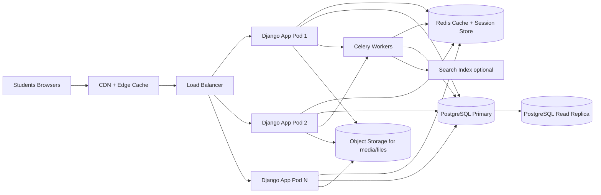

# Scalable Architecture Blueprint for 2,000 Concurrent Students

This document proposes a production-grade architecture for `pwaninet` that can handle a sudden exam-week traffic spike (about 2,000 students active at once), while keeping the system responsive for:

- browsing materials
- reading updates/posts
- searching users/groups/materials
- login/session operations

The plan is intentionally step-by-step so you can move from the current setup to a resilient architecture without a risky full rewrite.

---

## 0) Current State and Main Risk

Based on the existing project:

- Django app with server-rendered templates and HTMX partial updates
- SQLite as primary DB
- static and media currently local filesystem
- feed query logic with joins/annotations and ranking in `core/views.py`

Why this is risky for exam-day load:

1. **SQLite is the first scaling blocker**  
   SQLite does not handle high concurrent writes well and can become a lock bottleneck under login/post/like traffic.
2. **Single-node file storage is fragile**  
   Media/static tied to one server makes horizontal scaling and failover difficult.
3. **Feed/search endpoints are computation-heavy**  
   Ranking queries and repeated counts can hit DB hard when many students refresh together.
4. **No distributed cache or queue**  
   Every request recomputes expensive data; background work competes with user requests.

---

## 1) Target Architecture (High-Level)

Design principles:

- Keep Django monolith (fastest path), but add scale layers around it.
- Separate read-heavy traffic from write-heavy paths.
- Cache aggressively for exam materials and feed pages.
- Shift expensive tasks to background workers.

---

## 2) Capacity Targets and SLOs (Define Before Building)

Before implementation, define measurable service objectives:

- **Concurrent users target:** 2,000
- **Peak request rate target:** 300-700 req/s (depending on HTMX polling and page design)
- **Latency goals:**
  - p50 < 200ms (cached pages/fragments)
  - p95 < 800ms (dynamic feed/search)
  - p99 < 1.5s
- **Error budget:** < 1% 5xx during peak hour
- **Availability target:** 99.9% during exam week

Without explicit SLOs, scaling efforts become guesswork.

---

## 3) Step-by-Step Implementation Plan

## Step 1 - Production Baseline Hardening

Objective: make current app production-safe before scaling.

Actions:

1. Move secrets and env-specific values to environment variables:
   - `SECRET_KEY`, `DEBUG`, DB URL, cache URL, allowed hosts
2. Set `DEBUG = False` in production.
3. Add secure settings:
   - `SECURE_HSTS_SECONDS`
   - `SECURE_SSL_REDIRECT`
   - `SESSION_COOKIE_SECURE`
   - `CSRF_COOKIE_SECURE`
4. Add structured request logging (JSON).
5. Add health endpoints:
   - `/health/live`
   - `/health/ready` (checks DB + Redis)

Deliverable:

- Stable baseline deployment with proper observability and secure config.

---

## Step 2 - Replace SQLite with PostgreSQL

Objective: remove the biggest concurrency bottleneck.

Why PostgreSQL:

- better concurrent read/write behavior
- robust indexing and query planner
- replication support for scale

Actions:

1. Provision managed PostgreSQL (recommended) or self-host with backups.
2. Migrate schema/data from SQLite -> PostgreSQL.
3. Add connection pooling:
   - PgBouncer or app-level pooling
4. Set transaction boundaries for write-heavy endpoints (`like`, `follow`, invite responses).
5. Add critical indexes, especially for:
   - `Post(date, author_id, group_id, unit_id, course_id)`
   - `Like(post_id, user_id)` unique/index
   - `Notifications(recipient_id, is_read, timestamp)`
   - `Follow(follower_id, followed_id)`

Deliverable:

- App runs entirely on PostgreSQL with proven migration rollback plan.

---

## Step 3 - Introduce Redis (Cache + Sessions + Rate Limits)

Objective: reduce DB load and stabilize bursts.

Actions:

1. Store sessions in Redis (removes DB session pressure).
2. Cache expensive fragments:
   - home feed blocks
   - suggested groups
   - unread notification counts
3. Cache key design:
   - `feed:user:{id}:v{version}`
   - `notif:count:user:{id}`
4. Use short TTLs for volatile data (15-60s) and explicit invalidation on writes.
5. Add Redis-based throttling for abusive polling/search bursts.

Deliverable:

- Significant drop in repeated DB queries during refresh storms.

---

## Step 4 - Move Static and Media to Object Storage + CDN

Objective: offload file serving from app servers.

Actions:

1. Store user media and PDFs in object storage (e.g., S3-compatible bucket).
2. Front assets with CDN.
3. Configure long cache headers for immutable assets.
4. Use signed URLs for private or restricted files (if needed).
5. Keep app servers stateless so horizontal scaling is simple.

Deliverable:

- Materials/PDF downloads no longer consume app CPU/network heavily.

---

## Step 5 - Scale Django App Horizontally

Objective: support concurrent web traffic with multiple app instances.

Actions:

1. Run Django under Gunicorn/Uvicorn with tuned workers.
2. Deploy multiple app replicas behind load balancer.
3. Set autoscaling based on CPU, memory, and request latency.
4. Ensure no local state in app containers (sessions/files already externalized).
5. Add graceful shutdown and readiness probes.

Sizing guidance for first exam-week rollout:

- start with 3-5 app instances
- 2-4 workers each (depends on CPU)
- scale out under load test results, not guesswork

Deliverable:

- Multi-instance application tier with rolling deploy capability.

---

## Step 6 - Offload Heavy and Non-Interactive Work to Background Queue

Objective: keep request-response paths fast.

Actions:

1. Add Celery + Redis (or RabbitMQ) for background jobs.
2. Move non-critical tasks off request path:
   - bulk notifications
   - feed precomputation
   - media thumbnailing/conversion
   - periodic cache warm-up for trending materials
3. Add retry/backoff + dead-letter handling for failed jobs.

Deliverable:

- Users get quick responses while heavy tasks run asynchronously.

---

## Step 7 - Optimize Read-Heavy Endpoints (Feed, Search, Notifications)

Objective: keep p95 latency low during spikes.

### 7.1 Feed Optimization

Current feed logic already uses `select_related`, `prefetch_related`, and annotations, which is a good start.  
Next improvements:

1. Precompute a lightweight feed candidate set (background job).
2. Limit expensive annotations on every request.
3. Use pagination or infinite scroll with small page sizes.
4. Cache feed page 1 aggressively (most requested page).

### 7.2 Search Optimization

1. Add PostgreSQL trigram/full-text indexes for frequent search fields.
2. Debounce HTMX search requests on client side.
3. Cache common search queries briefly (10-30s).
4. For large growth, move to dedicated search engine (OpenSearch/Meilisearch).

### 7.3 Notification Optimization

1. Avoid counting unread rows repeatedly on every request.
2. Maintain cached unread counters per user.
3. Invalidate/update counter on notification write/read events.

Deliverable:

- Core student workflows stay fast even under synchronized traffic.

---

## Step 8 - Add Read Replica Strategy (Optional but Recommended)

Objective: protect primary DB during read surges.

Actions:

1. Add one PostgreSQL read replica.
2. Route read-heavy, non-critical queries to replica:
   - public feed reads
   - analytics-like counts
3. Keep writes and consistency-critical reads on primary.
4. Monitor replication lag and fallback automatically.

Deliverable:

- Better resilience under read storms without overloading primary.

---

## Step 9 - Add Protection Layers for Exam-Day Spikes

Objective: prevent total collapse when traffic exceeds forecast.

Actions:

1. Rate limit expensive endpoints per IP/user.
2. Add circuit breaker/fallback behavior:
   - if feed ranking fails, return simplified chronological feed
   - if search backend slows, return cached results + warning banner
3. Introduce request timeouts and bulkheads:
   - prevent one slow dependency from consuming all workers
4. Add queue backpressure handling (drop/defers non-urgent jobs).

Deliverable:

- Graceful degradation instead of full outage.

---

## Step 10 - Observability, Load Testing, and Runbooks

Objective: prove readiness before exam-week.

### 10.1 Observability

Track:

- app latency by endpoint (p50/p95/p99)
- DB query time and slow query log
- cache hit ratio
- worker queue depth and job latency
- error rates by endpoint

### 10.2 Load Testing

Run realistic scenarios with tools like k6/Locust:

1. Login burst
2. Home feed refresh burst
3. Search burst
4. Material download burst

Use staged tests:

- 200 users -> 500 -> 1,000 -> 2,000
- hold each stage long enough to observe saturation

### 10.3 Runbooks

Prepare incident playbooks for:

- DB saturation
- cache outage
- queue backlog
- hot endpoint regression

Deliverable:

- Tested architecture with operational confidence.

---

## 4) Recommended Deployment Topology (Practical)

Minimum production shape for your target:

- **CDN:** Cloudflare or equivalent
- **Load balancer:** managed L7 LB
- **App tier:** 3-5 Django instances
- **DB:** managed PostgreSQL (primary + optional read replica)
- **Cache:** managed Redis
- **Queue workers:** 2+ Celery workers
- **Storage:** object storage for media/material files
- **Monitoring:** Prometheus/Grafana or cloud-native monitoring + alerting

This is enough for 2,000 concurrent users if queries are indexed/cached and files are CDN-served.

---

## 5) Data and Query Design Guidelines

For sustained performance, enforce these rules:

1. Every frequently filtered/joined field must have an index.
2. No endpoint should execute unbounded queries.
3. Paginate lists; never render very large sets in one request.
4. Use `select_related` / `prefetch_related` consistently.
5. Cache first-page and hot fragments.
6. Profile SQL and eliminate N+1 regressions before each release.

---

## 6) Security and Reliability Essentials

1. Enforce HTTPS and secure cookies.
2. Backup PostgreSQL automatically with PITR (point-in-time recovery).
3. Version and test DB migrations in staging before production.
4. Use blue/green or rolling deploys with health checks.
5. Keep a disaster recovery plan with RTO/RPO targets.

---

## 7) Phased Timeline (Suggested)

- **Week 1:** Baseline hardening + observability + PostgreSQL migration plan
- **Week 2:** Redis cache/session + key endpoint caching + indexing
- **Week 3:** Object storage + CDN + horizontal app scaling
- **Week 4:** Queue workers + load tests + runbooks + game-day drills

You can compress this with focused effort, but do not skip load testing.

---

## 8) Concrete Outcome You Should Expect

After implementing this architecture:

- the system handles synchronized student bursts far better
- file/material traffic is mostly served from CDN, not app servers
- feed/search reads are cached and indexed
- background jobs no longer slow user requests
- failures degrade gracefully instead of causing hard downtime

---

## 9) Immediate Next Actions for This Project

1. Switch from SQLite to PostgreSQL first.
2. Add Redis and cache the home feed + notification counts.
3. Move PDFs/media to object storage and front with CDN.
4. Run first load test to identify the next bottleneck.
5. Iterate based on metrics, not assumptions.

These five steps alone will provide the biggest early win for exam-week reliability.
